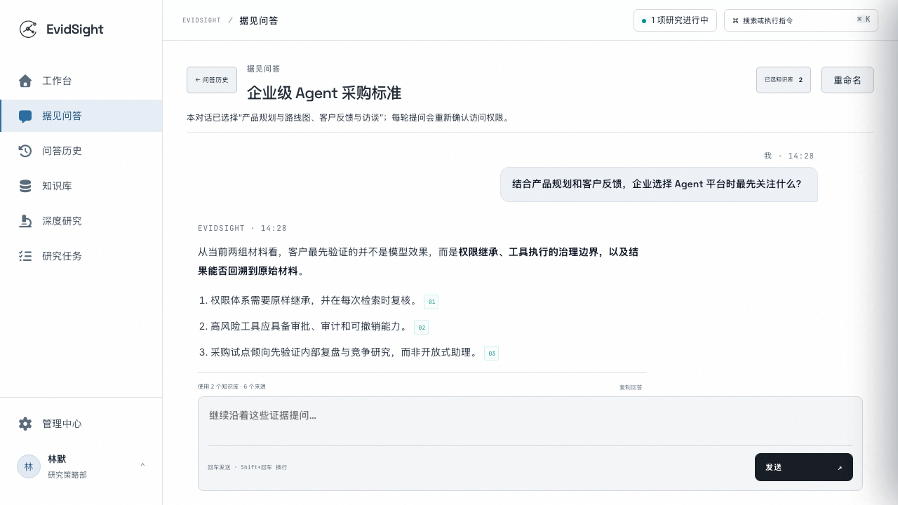
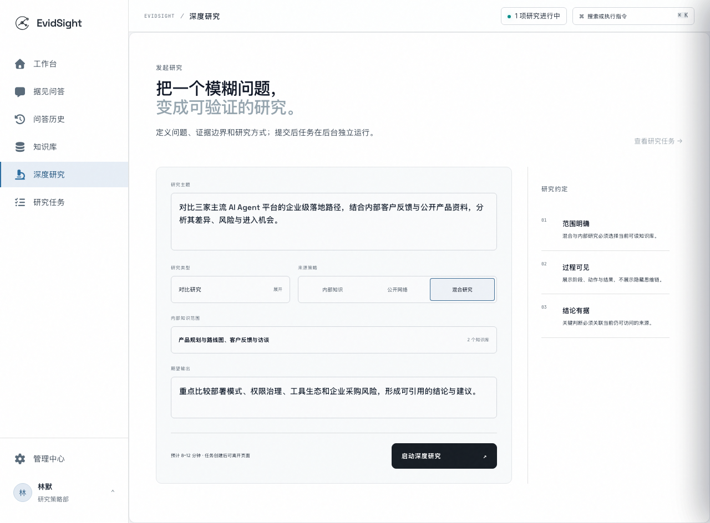
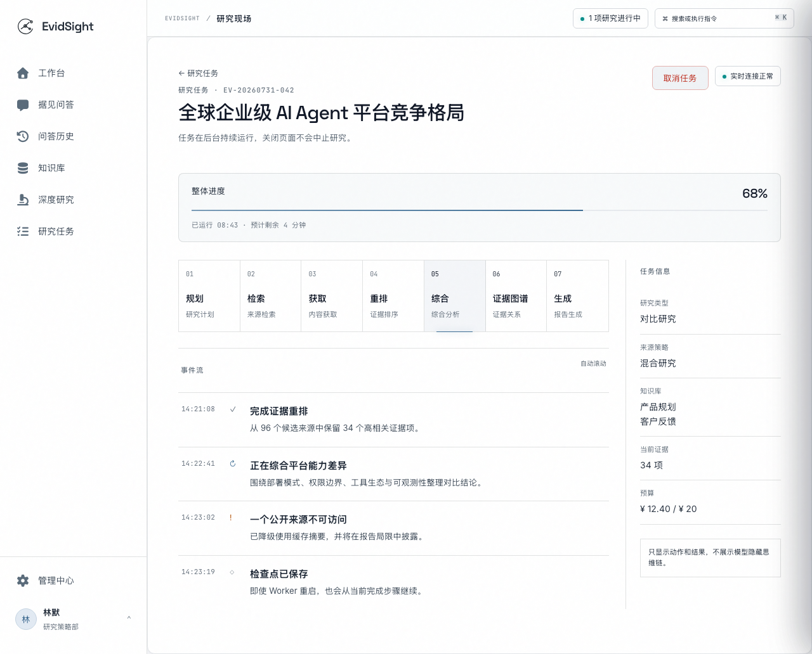
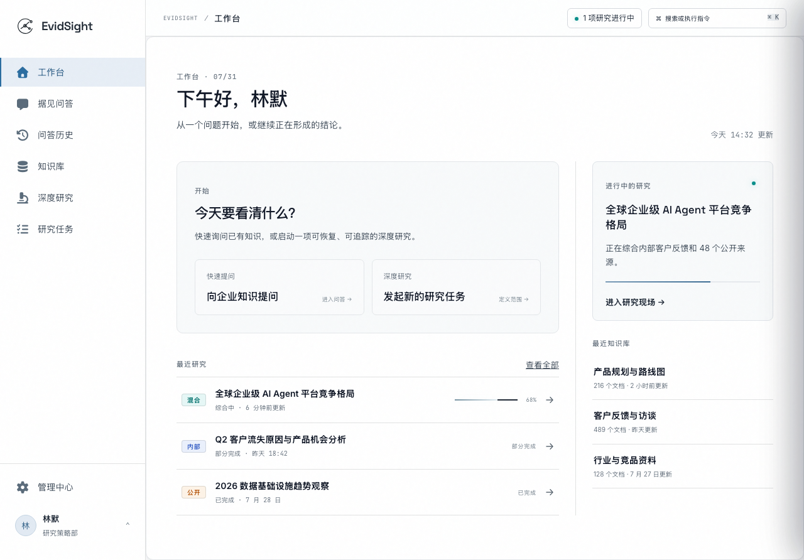
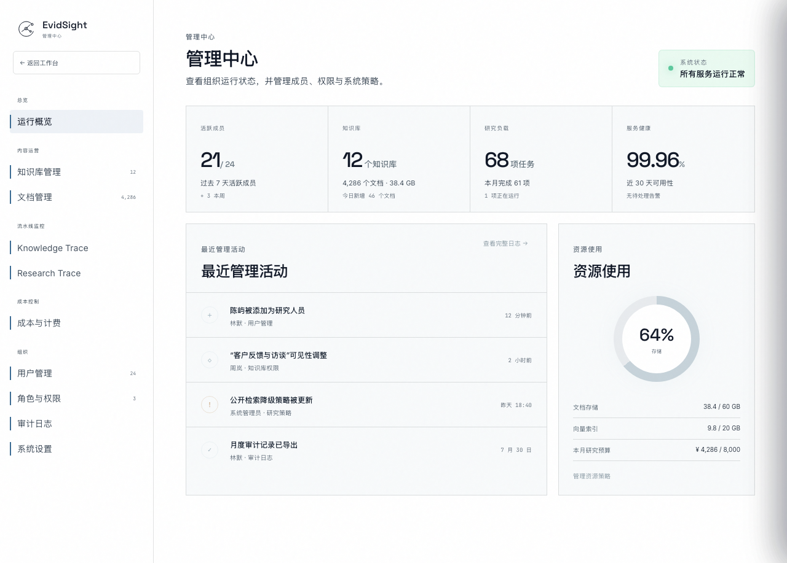

# 据见（EvidSight）

> **有据，方有见。**

据见是一款面向企业的 AI 驱动可信研究平台。它将企业内部知识与互联网信息统一检索、分析和验证，让每个结论都可追溯、可复核。

---

## 产品简介

企业研究通常依赖内部文档、市场材料、政策法规等多类分散来源。据见提供统一入口，根据问题复杂度自动匹配知识问答、综合问答或深度研究，支持仅使用企业知识、仅使用互联网、或混合使用两类来源。

### 核心能力

**企业知识问答** — 上传文档构建知识库，自然语言提问获得带来源引用的流式回答。系统支持多轮对话，每次回答都关联具体来源位置。



**深度研究** — 面对复杂问题时，系统启动多阶段 Agent 执行研究。支持对比型、解释型和影响分析型任务，用户可选择仅使用企业知识、仅使用互联网、或混合使用两类来源。



**证据驱动报告** — 研究完成后生成结构化报告，关键结论关联证据，证据可追溯到原始来源位置。内外来源清晰区分，冲突与不确定性显式展示，不会将矛盾信息伪装为确定事实。



**权限感知** — 研究和报告不绕过原知识来源的访问权限。内部证据进入报告不会赋予永久访问权，用户打开原文时按当前权限重新校验。

## 技术架构

据见采用 Monorepo 结构，前后端分离，服务间通过契约通信。Knowledge Service 负责身份认证、知识库管理和知识问答；Research Service 负责研究任务执行和报告生成。两个服务通过 `Internal Retrieval API` 协作，Research 不直读 Knowledge 数据库。

```
┌─────────────────────────────────────────────────────────────┐
│                        Nginx 统一入口                        │
│              (TLS 终止 / SPA 静态文件 / 路由)                 │
└──────────────┬──────────────────────────┬───────────────────┘
               │                          │
    ┌──────────▼──────────┐    ┌──────────▼──────────┐
    │   Knowledge API     │    │   Research API      │
    │   (FastAPI)         │    │   (FastAPI)         │
    │   - 身份认证         │    │   - 研究任务         │
    │   - 知识库管理       │    │   - Agent Runtime   │
    │   - 知识问答         │    │   - 报告生成         │
    │   - Internal API    │◄───│   - SSE 推送         │
    └──────────┬──────────┘    └──────────┬──────────┘
               │                          │
    ┌──────────▼──────────┐    ┌──────────▼──────────┐
    │ Knowledge Worker    │    │ Research Worker     │
    │ (Celery)            │    │ (Celery)            │
    │ - 文档入库           │    │ - 研究执行           │
    │ - 解析/分块/Embedding│    │ - 重试与恢复         │
    └─────────────────────┘    └─────────────────────┘
               │                          │
    ┌──────────▼──────────────────────────▼──────────┐
    │              MySQL 8 / Redis 7                  │
    │         (三个逻辑数据库 / 队列与缓存)             │
    └─────────────────────────────────────────────────┘
```

用户登录后进入统一工作台，从同一入口访问知识中心、问答、研究和管理功能：



## 技术栈

| 层级 | 技术选型 |
|:---|:---|
| **前端** | Vue 3 + TypeScript、Vite、Pinia、Vue Router、Element Plus、ECharts |
| **后端** | Python 3.12、FastAPI、SQLAlchemy (async)、Celery、Alembic |
| **数据库** | MySQL 8.0（三个逻辑数据库）、Redis 7（队列/缓存/锁） |
| **向量存储** | ChromaDB（嵌入式，Knowledge 服务管理） |
| **LLM / Embedding** | OpenAI 兼容接口（DeepSeek / 通义千问等） |
| **RAG Pipeline** | LangChain、BM25 + 向量召回、RRF 融合、Rerank |
| **部署** | Docker Compose、Nginx、生产三节点 2C2G、开发单机全栈 |

## 部署架构

v1.0 目标生产环境按三台 2C2G 云服务器拆分为 Edge/Research、Data 和 Knowledge 三个数据岛，面向 10–30 名低并发试点用户。只有云节点 1 的 Nginx 暴露公网端口，MySQL、Redis、Knowledge API 和 Internal API 均只通过生产私网访问。该目标拓扑已由 [ADR-011](docs/decisions/ADR-011-three-node-distributed-deployment.md) 接受，生产 Compose 资产与实际部署验证属于 M5，当前不得视为已经落地。

```
Browser ──► 云节点 1：Nginx / Web
                        │
                        ├── Research API / Worker / Beat
                        │
                        ├────私网────► 云节点 2：MySQL / Redis
                        │
                        └────私网────► 云节点 3：Knowledge API / Worker / Beat
                                                    │
                                              uploads / Chroma
```

Mac 继续通过根 `docker-compose.yml` 在本地启动完整开发栈，不依赖生产节点；Windows 与 Mac 均不承担生产唯一职责。

## 快速开始

### 环境要求

| 工具 | 版本 |
|:---|:---|
| Python | 3.12+ |
| Node.js | 20+ |
| Docker Engine | 24+ |
| Docker Compose | v2 |

### Mac/开发机 Docker Compose 一键启动

```bash
# 复制环境变量并填写 LLM/Embedding 等 API Key
cp .env.example .env

# 启动全部服务
docker compose up -d

# 查看状态
docker compose ps
```

### 本地开发启动

```bash
# Knowledge Service
uv sync --project services/knowledge --locked
uv run --project services/knowledge alembic upgrade head
uv run --project services/knowledge uvicorn app.main:app --reload --port 8000

# Research Service
uv sync --project services/research --locked
uv run --project services/research alembic upgrade head
uv run --project services/research uvicorn app.main:app --reload --port 8001

# Web 前端
npm --prefix apps/web ci
npm --prefix apps/web run dev
```

### 验证命令

```bash
# 全量测试
bash scripts/test_all.sh

# 前端构建
make build-web

# Compose 配置校验
docker compose config --quiet
```

本地启动完成后，管理员可以通过管理中心管理用户、知识库和研究任务：



## 项目状态

据见已完成 M0—M3，**M4：统一 Web、报告与证据联动尚未开始**。统一前端、三节点生产部署资产、治理与部署验收、v1.0 发布门禁为后续里程碑。当前前端为 M0 迁入的 Vue 基线，M4 将按前端专项规范迁向 React。里程碑状态与验证记录以 [路线图](docs/plans/ROADMAP.md) 为准。

## 开发说明

项目采用规范驱动开发（SDD）流程：先确认权威规范和验收条件，再写测试与实现，最后同步文档和变更记录。

完整文档索引见 [文档中心](docs/README.md)，开发指南详见 [docs/guides/DEVELOPMENT.md](docs/guides/DEVELOPMENT.md)。

## License

正式发布前将完成来源项目许可证兼容复核。
