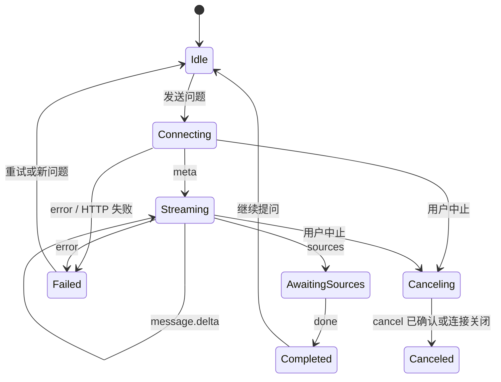
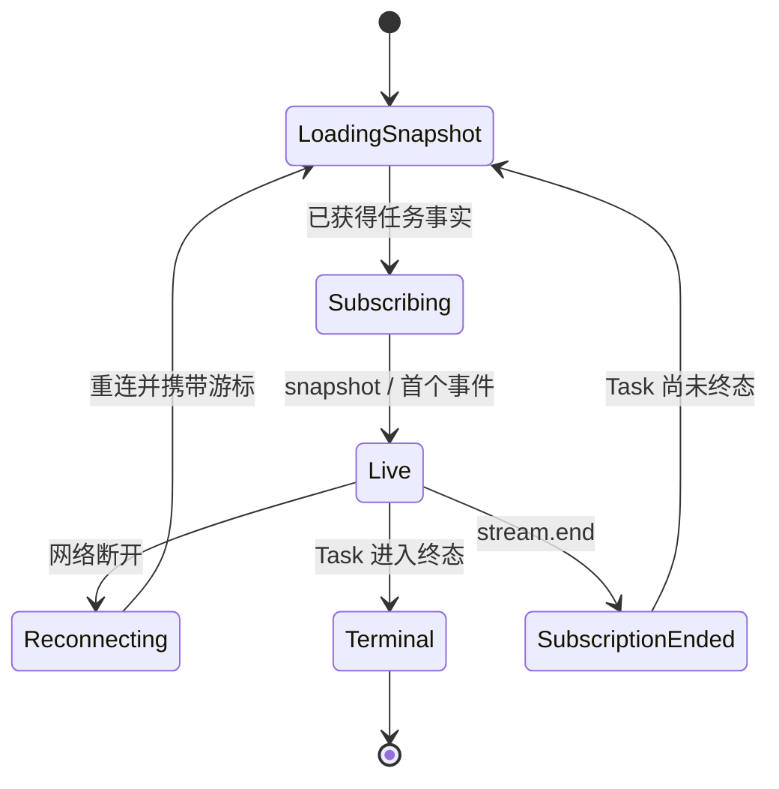

# EvidSight Web 前端页面、交互与状态机设计

> 状态：v1.0 实施基线  
> 最后更新：2026-08-08
> 权威范围：`apps/web/` 的信息架构、页面行为、客户端状态机与前端验收  
> 视觉规范：[UIDESIGN.md](UIDESIGN.md)  
> 产品需求：[PRD.md](../../../docs/specs/PRD.md)
> 接口协议：[API.md](../../../docs/specs/API.md)

## 1. 目标与边界

EvidSight Web 是知识库、企业知识问答、深度研究、研究报告和组织治理的唯一浏览器入口。前端必须让用户在同一身份和导航体系内完成“材料进入知识—知识支持问答与研究—结论回到证据”的闭环。

本文定义：

- 页面与路由；
- 页面级交互、空态、错误态和恢复行为；
- Chat SSE 与 Research SSE 的独立客户端状态机；
- 报告引用、Evidence Graph 和原文切片的联动；
- 管理中心的信息架构；
- 前端安全边界、可访问性与验收场景。

本文不重复定义后端权限、数据库、Pipeline 内部阶段或 API 字段。发生冲突时，身份权限以 `IDENTITY_AND_ACCESS.md` 为准，协议以 `API.md` 为准，业务状态以对应 Pipeline 文档为准。

## 2. 技术基线与目录边界

### 2.1 技术栈

v1.0 前端采用：

- React + TypeScript；
- Vite 作为开发与构建工具；
- React Router 管理客户端路由；
- TanStack Query 管理服务端状态、缓存和失效；
- Tailwind CSS 承载 Design Token 映射与布局工具类；
- `react-markdown` 渲染 Chat 系统回答正文（CommonMark 兼容；后端注入的 `[来源N]` 标记经预处理 + 自定义 `a` 组件转为内联引用按钮）；
- 组件样式与交互必须遵守 [UIDESIGN.md](UIDESIGN.md)，不得直接复制 DocMind 或 ResearchMind 的旧视觉层。

除非新增依赖能够显著降低状态机、无障碍或测试复杂度，否则不引入大型 UI 组件库。图标使用统一图标源并通过组件封装，不混用 Emoji、字符图标和多套图标库。

### 2.2 工程工具链

- `apps/web` 统一使用 `pnpm`，版本由 `package.json#packageManager` 固定；仓库只保留 `pnpm-lock.yaml`，不得并存 `package-lock.json`、`yarn.lock` 或 bun 锁文件；
- 依赖安装使用 `pnpm --dir apps/web install --frozen-lockfile`，开发、测试和构建均通过 `package.json` scripts 进入；
- ESLint 负责 TypeScript、React Hooks 和 Vite React Refresh 的静态检查；`lint` 与提交 hook 只报告，不自动修改；
- Prettier 是 Web 源码与工程文件的唯一格式化器；`format:check` 与提交 hook 只检查，显式执行 `format` 才允许写入；
- 根 `.editorconfig` 统一 UTF-8、LF、文件末尾换行和两空格缩进，Prettier 负责的格式规则以 Prettier 配置为准；
- 根 `.pre-commit-config.yaml` 在前端相关文件进入暂存区时执行 ESLint 与 Prettier 检查，并继续复用现有 Python ruff 与提交信息门禁；任何 hook 均不得静默改写暂存文件。

工具链验收条件：锁文件可由固定 pnpm 版本冻结安装；`lint`、`format:check`、`test`、`build` 全部通过；pre-commit 配置合法，前端 lint 或格式错误会使对应 hook 非零退出；仓库当前执行入口不再调用 npm。ADR 检查 1–8：否（可逆、低成本的局部开发工具链调整，不改变服务边界、公共契约、数据、安全或产品行为）。（2026-08-08）

### 2.3 建议目录

```text
apps/web/src/
├── app/                 # Router、Provider、应用壳层与全局错误边界
├── api/                 # Auth、Knowledge、Chat、Research、Admin 客户端
├── components/          # 无业务所有权的通用组件
├── features/
│   ├── auth/
│   ├── workbench/
│   ├── knowledge/
│   ├── chat/
│   ├── research/
│   ├── report/
│   └── admin/
├── hooks/               # SSE、焦点、快捷键等共享 Hook
├── state/               # 仅保存真正的客户端状态
├── styles/              # Token、字体、全局层与打印样式
└── test/                # Fixture、MSW、契约样例与测试工具
```

功能模块不得直接读取其他模块的内部 Store。跨模块数据通过稳定的 API Query、路由参数或公开组件接口传递。

### 2.4 视觉实现输入

前端页面不得只根据自然语言规格重新设计。每个页面切片开始前必须同时读取：

1. 本文对应页面行为与状态；
2. [UIDESIGN.md](UIDESIGN.md) 的 Token、组件和视觉门禁；
3. [`resource/prototype/reference/evidsight-web/prototype-manifest.json`](../../../resource/prototype/reference/evidsight-web/prototype-manifest.json) 指向的跟踪版交互原型；
4. manifest 对应的 light/dark PNG。

跟踪版原型只定义页面结构、动作位置、排版节奏和品牌资产，不定义 API、权限、路由或状态机。原型与本文、API 或 ADR 冲突时，暂停实现并按文档治理流程裁决。`.superpowers/` 是 Git 忽略的工具临时目录，不得作为生产开发输入或运行时依赖。

页面使用 Canvas、Route Surface、Inset Panel、Action Card、Ledger、Context Rail、Reader、Overlay 或 Admin Surface 的位置，以 [UIDESIGN.md §5.5–§5.6 与 §7](UIDESIGN.md#5-布局系统) 为唯一视觉事实；本文只定义页面行为和状态，不重复维护容器样式。任何页面开始实现前必须先定位其 Frame 行和逐页规格，不能从已完成页面复制一个通用 Card 外壳。

## 3. 信息架构与路由

### 3.1 公共入口

| 路由 | 页面 | 访问规则 | 原型 |
|---|---|---|---|
| `/` | 全屏叙事入口 | 匿名可见；已登录可进入工作台 | [01-landing.png](../../../resource/prototype/light/01-landing.png) |
| `/login` | 登录右侧抽屉状态 | 匿名；在入口页上层展示，不使用独立卡片页 | 同上 |

入口页采用全屏叙事流。Header 中品牌位于左侧，产品能力、研究方式、安全与证据及登录入口组成右侧实用导航。登录从右侧滑出；关闭后保留入口页滚动位置。

### 3.2 登录后主导航

| 路由 | 页面 | 原型 |
|---|---|---|
| `/workbench` | 工作台 | [02-workbench.png](../../../resource/prototype/light/02-workbench.png) |
| `/chat` | 据见问答 | [07-chat.png](../../../resource/prototype/light/07-chat.png) |
| `/chat/history` | 问答历史 | [08-chat-history.png](../../../resource/prototype/light/08-chat-history.png) |
| `/knowledge-bases` | 知识库列表 | [09-knowledge.png](../../../resource/prototype/light/09-knowledge.png) |
| `/knowledge-bases/:kbId` | 知识库详情与文档 | [10-knowledge-detail.png](../../../resource/prototype/light/10-knowledge-detail.png) |
| `/research/new` | 创建深度研究 | [03-research-create.png](../../../resource/prototype/light/03-research-create.png) |
| `/research` | 研究任务列表 | [04-research-tasks.png](../../../resource/prototype/light/04-research-tasks.png) |
| `/research/:taskId` | 研究运行态 | [05-research-runtime.png](../../../resource/prototype/light/05-research-runtime.png) |
| `/reports/:reportId` | 最终研究报告 | [06-research-report.png](../../../resource/prototype/light/06-research-report.png) |
| `/admin` | 管理中心 | [11-admin-overview.png](../../../resource/prototype/light/11-admin-overview.png) |

URL 必须承载可恢复的资源标识。筛选、分页、选中章节等需要分享或刷新后保留的状态写入查询参数；临时抽屉、Popover 和确认框保留在页面状态中。

### 3.3 全局应用壳层

普通业务页面共享左侧一级导航和顶部上下文栏。左侧顺序固定为：

1. 工作台；
2. 据见问答；
3. 问答历史；
4. 知识库；
5. 深度研究；
6. 研究任务。

管理中心入口与账号区域固定在侧边栏底部。账号菜单提供“修改密码”、“主题选择”和“退出登录”。修改密码使用右侧抽屉，成功后弹全局成功 Toast「密码已修改」；主题选择使用居中选择卡片并按 §4.4 的两步骤确认流程切换，确认后弹全局成功 Toast；退出登录使用具名确认框（「退出后需要重新登录才能继续访问」），确认后清理会话并弹全局成功 Toast「已退出登录」。

管理中心不嵌套普通工作台侧边栏。进入 `/admin` 后切换为独立管理壳层，管理侧边栏成为一级导航，并提供明确的“返回工作台”。

### 3.4 命令入口

顶部栏右侧（运行任务 Chip 之后）常驻命令入口按钮「搜索或执行指令」，携带 `⌘K` 快捷键提示。`⌘K` 或点击按钮后，按钮**原位展开为搜索输入框**（不弹出独立面板），焦点进入输入框；输入有匹配后才在输入框下方弹出过滤后的命令列表，空输入不显示列表。`Escape` 或点击输入框外部关闭并恢复命令入口按钮。v1 命令范围限定为**页面导航与明确创建动作**，不执行任意指令、不跨数据源全文搜索：

- 工作台 → `/workbench`；
- 据见问答 → `/chat`；
- 问答历史 → `/chat/history`；
- 知识库 → `/knowledge-bases`；
- 深度研究 → `/research/new`；
- 研究任务 → `/research`；
- 创建知识库 → `/knowledge-bases?create=1`。

列表支持 `↑`/`↓` 移动、`Enter` 执行当前项、点击执行。输入无匹配时展示「无匹配命令」。命令执行后关闭面板并导航；导航命令使用应用内路由，不触发整页刷新。视觉规格见 UIDESIGN §7.22。

## 4. 全局状态与导航行为

### 4.1 服务端状态与客户端状态

以下数据属于服务端事实，不得长期复制到全局客户端 Store：用户摘要、知识库、文档状态、会话、任务、Evidence、报告、管理记录和计费数据。

客户端 Store 只保存：

- 当前临时抽屉或对话框；
- 未提交的编辑草稿；
- 命令面板状态；
- 非 URL 型的短期选择；
- Research SSE 的最近事件游标和连接展示状态。

Query Key 必须包含资源范围，例如 `['knowledge-base', kbId]`、`['conversation', conversationId]`、`['research-task', taskId]`。退出登录时清除全部受保护 Query、SSE 连接和敏感页面状态。

### 4.2 路由保护

- 匿名访问受保护路由时跳转入口页并打开登录抽屉；登录成功后返回原目标。
- 用户无权访问资源时展示统一的 403/404 安全状态，不保留旧资源正文。
- 管理入口按角色显示；直接访问 `/admin` 仍必须由服务端鉴权。
- 用户被禁用或 Refresh 失败时停止新请求和订阅，清理会话并返回登录入口。

### 4.3 全局运行任务提示

顶部栏常驻运行任务 Chip：有运行任务时显示「N 项研究进行中」（青色信号点，`--es-spectral-cyan`），无运行任务时显示「暂无任务进行」（中性点），两种状态都保留可见，便于感知当前是否在跑任务。该提示只表达持久任务状态，不表达 SSE 是否连接。点击 Chip 弹出具名确认框「是否跳转到研究任务？」，确认后进入研究任务列表；取消则停留当前页。离开运行态页面不得取消任务。

### 4.4 主题与外观

- 默认主题为浅色：登录抽屉与登录后的工作区默认使用浅色主题；
- 入口全屏叙事页固定保留品牌深色叙事，不随主题切换；
- 主题切换使用账号菜单「主题选择」的两步骤确认流程（视觉规格见 [UIDESIGN.md](UIDESIGN.md) §7.21 主题选择卡片）：
   1. 打开居中选择卡片，展示浅色/深色两个选项（各带固定色板预览），标注当前主题；
   2. 点击某个选项后弹出「切换主题？」确认卡片，叠加在选择卡片之上（选择卡片保持可见且不参与交互）；确认后才应用并持久化到 `localStorage`（键 `evidsight-theme`），刷新与重新登录后保持；确认卡片取消返回选择卡片，选择卡片取消关闭；
   3. 确认切换后，顶部弹出成功反馈 Toast「已切换为X主题」（`role="status"`，约 2.6 秒自动消失，视觉见 UIDESIGN §6.13）；
- 退出登录不清除主题偏好；主题只改变视觉 Token 映射（见 [UIDESIGN.md](UIDESIGN.md) §4），不改变布局、信息架构或业务行为；
- 业务组件只消费 `--es-*` Design Token，禁止按主题硬编码颜色；深浅主题任一主题下均须满足 WCAG AA 对比度。

## 5. 页面设计

### 5.1 全屏叙事入口与登录

入口页由 Hero、可信能力、研究方式与证据安全模块纵向堆叠。Hero 只包含品牌叙事、主要入口和艺术化线条背景，不放置登录卡片、伪造客户 Logo 或无法证明的社会证明。入口页固定保留深色品牌叙事，不随用户主题选择切换。

登录抽屉包含账号、密码、显示密码、记住登录状态与提交按钮，默认使用浅色主题。登录错误文案不区分“用户不存在”和“密码错误”；注册失败使用独立文案（创建账号失败），不与登录错误混用。提交期间按钮进入忙碌状态并防止重复请求；成功后默认进入 `/workbench`。登录成功（含“注册并登录”）后显示可跨导航存活的全局成功 Toast：登录为“欢迎回来，{用户名}”，注册为“注册成功，欢迎加入，{用户名}”；语义与视觉见 [UIDESIGN §6.13](UIDESIGN.md)。

### 5.1.1 身份恢复

前端身份的权威来源是 `GET /api/v1/auth/me`，返回 `UserSummary`（`id` 为 UUID 字符串，`username`/`role`/`status` 来自数据库当前状态）。客户端不得从 Access Token Claim 解析或拼装用户名、角色、状态，也不得对 `id` 做数值解析。

- 登录成功保存 Access Token 后调用 `/me`，**成功后才建立** `user` 状态；失败按未登录处理。
- 注册、登录、刷新、退出、改密和 `/me` 目标态均调用 `/api/v1/auth/*`；旧 `/api/auth/*` 只允许作为迁移期兼容测试，不得在新代码中新增依赖。
- 页面重载时**不恢复持久化的 `user`**，用 Access Token 调用 `/me` 重建身份。
- `/me` 返回 `401`、用户被禁用或请求失败时，清除 Token、清理会话并返回登录入口。
- Refresh 成功后重新调用 `/me`，以获取可能变化的角色与状态。
- `isLoggedIn` 在 `/me` 完成前保持「未就绪」态，受保护路由不得提前进入。
- 任何 User DTO 的 `id` 都按 Platform User UUID 字符串处理；前端不得接受、缓存或向下游传递旧 `id=int` 用户身份。

### 5.1.2 Refresh Cookie 与 CSRF

前端目标态不读取、不保存、不传递 Refresh Token 明文。登录和刷新只消费响应体中的 Access Token；Refresh Token 由 Knowledge 通过 HttpOnly Cookie 持有并随 `/api/v1/auth/refresh`、`/api/v1/auth/logout` 自动发送。

- API 客户端必须启用凭据携带，使 Refresh Cookie 只发送到 Auth 端点；
- 刷新和退出请求必须读取非 HttpOnly CSRF Cookie，并以 `X-CSRF-Token` Header 回传；
- CSRF Header/Cookie 缺失、不一致或 Origin 被拒绝时，前端按刷新失败处理：清除 Access Token、用户状态、Query、SSE 和敏感页面快照，返回登录入口；
- 前端不得把 Refresh Token 写入 Local Storage、Session Storage、IndexedDB、可读 Cookie、Pinia 持久状态、URL、日志或 Analytics；
- M1 迁移期若后端仍允许 body `refresh_token`，旧调用只用于兼容测试；新代码不得新增对 `localStorage.refresh_token` 的读写。

### 5.2 工作台

工作台是行动入口而非统计仪表盘：

- 主要区域提供快速提问与深度研究入口；每张快速开始卡片的说明标题居左、动作文案（进入问答/定义范围）位于卡片右下侧、与标题文案同一水平线；
- `RECENT RESEARCH` 展示最近研究任务及可执行入口；
- `RECENT KNOWLEDGE` 展示最近使用或更新的知识库；
- 正在运行的任务提供”继续查看”而非重新创建。

右侧上下文列中「进行中的研究」卡片始终渲染：有运行任务时展示任务、进度与「进入研究现场」；无运行任务时在卡片内展示「暂无进行中的研究」占位与「开始研究」入口，卡片不隐藏。`RECENT KNOWLEDGE` 固定在卡片下方，不随运行状态上下浮动。

无历史数据时分别提供”开始研究”和”创建知识库”，不展示空 KPI 卡片。`RECENT RESEARCH` 空态中，”开始研究”按钮位于”查看全部”下方右侧，与”明确研究范围，系统会持续保存任务事实。”说明句处于同一水平线（说明居左、动作居右）。

### 5.3 知识库列表

列表按用户当前可见范围查询，支持“全部、我创建的、组织公开”三个真实 Scope 与名称搜索；搜索只承诺当前 API 支持的名称，不得扩展为描述或 Owner 搜索。切换 Scope 时清除名称搜索条件，避免关键字跨范围残留。视觉结构以 [UIDESIGN §7.9](UIDESIGN.md#79-知识库列表-knowledge-bases) 为准。

每行展示名称、描述、可见性、文档数、索引状态、更新时间、Owner 用户名和“进入知识库”主操作：

- 可见性同时使用文字和视觉标记，前端不得根据管理员角色推断其可以读取私有内容；
- 索引状态消费 `KnowledgeBaseResponse.index_status` 的 `ready|updating|recovering`，映射为“可检索 / 索引更新中 / 恢复中”；字段缺失时展示占位，不得根据 `chunk_count` 猜测；
- 更新时间统一显示本地绝对时间 `YYYY-MM-DD HH:mm`；
- 编辑和删除知识库收敛到行内 `⋮` 溢出菜单（共享 `RowMenu`），按 Owner 或管理员治理权限显示，只读成员不显示菜单；删除成功后从列表缓存移除对应行并给出全局成功反馈；
- 默认每页 10 条，分页消费后端 `page/page_size/total`，支持上一页、页码窗口、省略号和下一页；
- 搜索无匹配时显示“没有匹配的知识库，换个名称再试”，不重复页面头部的创建动作；真正无数据时显示“还没有知识库”和新建入口；
- 页尾说明只有已完成或部分完成且具有有效来源的文档参与检索，失败与等待中文档不成为答案依据。

### 5.4 知识库详情与文档管理

详情展示返回入口、知识库名称与描述、Owner、可见性、更新时间、文档摘要、文档账本和治理动作；视觉布局以 [UIDESIGN §7.10](UIDESIGN.md#710-知识库详情-knowledge-baseskbid) 为准。

权限与数据规则：

- Owner 展示优先使用后端 `owner_username`；字段缺失且当前用户就是 Owner 时可以回退 `/me` 用户名，非 Owner 不得伪造他人用户名；
- 上传文档仅 Owner 可见，Public KB 的 Owner 仍可上传；管理员非 Owner 不得代替上传；
- 编辑、删除知识库由列表行 `⋮` 菜单提供（Owner 或管理员治理权限，见 §5.3），详情页不提供知识库级编辑/删除；文档删除仍按 Owner 或管理员治理权限显示；
- 详情页 Hero 提供“用它提问”主按钮，位于上传文档左侧，点击进入 `/chat?kb=:uuid` 并预选该知识库（见 §5.5）；所有可见用户可用，上传文档仍仅 Owner 可见；
- 摘要只展示知识库响应已有的文档总数、分块总数和创建时间；缺少权威聚合字段时，不推算“可检索/处理中/需处理”等计数。

文档列表展示文件名、状态、有效片段、更新时间和操作，支持后端单值 `status` 六状态筛选、`filename` 搜索和分页。搜索或筛选无匹配与真正无文档使用不同空态。Partial/failed 展示 API 返回的安全错误摘要；queued/processing/deleting 不渲染伪操作。存在非终态文档时每 5 秒刷新列表，全部进入终态后停止。

上传使用右侧 Drawer，支持 PDF、DOCX、Markdown、TXT，单文件不超过 50 MB。前端允许多选并以队列串行调用既有单文件上传 API；同名和非法扩展名文件忽略并提示。上传中逐文件展示状态；取消操作中止当前批次并把未开始项目标记为取消，Drawer 保持打开。任一文件上传成功后关闭 Drawer、刷新文档列表，后续解析和索引由后台继续执行，不依赖浏览器连接。

创建和编辑知识库时，名称与描述展示长度约束和字数计数；可见性选项必须同时提供标题与说明。删除知识库和文档使用具名确认，提交期间防重复，成功使用全局 Toast，失败使用标准错误信封中的安全文案。

文档状态映射：

| API 状态 | UI 文案 | 可执行操作 |
|---|---|---|
| `queued` | 等待处理 | 无 |
| `processing` | 处理中 | 无 |
| `completed` | 可检索 | 查看切片、删除（Owner 或管理员） |
| `partial` | 部分可用 | 查看安全错误摘要、重试（Owner） |
| `failed` | 处理失败 | 查看安全错误摘要、重试（Owner） |
| `deleting` | 删除中 | 无 |

“查看切片”打开切片 Drawer，展示文档名、位置、Token 数、相邻切片和引用标记。每次打开均重新请求并鉴权；撤权或来源不可用后立即移除正文、保留历史元数据并显示不可访问状态。相邻切片只基于当前已加载列表的 `chunk_index ± 1`，不新增推测端点。

切片抽屉与分块列表使用稳定 `segment_id`，并据此调用 `GET /api/v1/documents/{document_id}/locations/{location_id}`。前端不得读取、传递或依赖迁移期内部整数 `id`。复核和实现轨迹见 [M4 前端视觉纠偏实施过程记录](M4_FRONTEND_CORRECTION_IMPLEMENTATION_LOG.md)。

### 5.5 据见问答

页面以对话为主体，系统消息位于左侧、用户消息位于右侧，不显示装饰性机器人头像。角色名称字号高于元数据。

知识范围使用可演进的知识库选择器，而不是抽象的“文档范围”。v1.0 的 Chat 只允许选择一个知识库；组件保留未来多选的布局与信息层级，但多选控件不可执行，并以“多知识库问答规划中”提示用户，不得通过前端聚合或重复请求模拟多 KB Chat：

- 支持名称搜索；
- 默认按最近更新时间倒序；
- 展示 owner、可见性和文档量作为辅助信息；
- 用户单选一个知识库；切换知识库前必须明确提示会话范围变化；
- 发送时只提交一个 `knowledge_base_id`，服务端不得隐式扩大范围；
- 多选能力作为 v1.x TODO 保留，启用前必须解决 Per-KB Collection 的缓存、内存、跨 KB 排序和部分失败语义，并先修订权威规范。

选择器从右侧滑出或以宽 Popover 展示，不长期占用对话宽度。来源编号/引用标记打开右侧来源详情抽屉（回答依据、知识库、文档、定位、预览与相关度），抽屉内可继续进入对应文档切片抽屉；来源与切片复用知识中心既有原文抽屉（`ChunkDrawer`）与实时鉴权，不另起第二套原文阅读器。回答的 `sources` 在流结束时以 canonical wire 投影持久化到该条 assistant 消息（API.md §12），刷新或重新打开会话后由 `GET /api/v1/conversations/{conversation_id}` 详情回读恢复；`confidence`/`confidence_note` 仅随 SSE `sources` 事件瞬时存在、不持久化，刷新后不展示。历史回读的合并优先级：持久化 `Message.sources` 非空时为权威，内存 `completedSources` 仅作回读前瞬时兜底并承载实时置信度。

系统回答正文以 markdown 渲染（react-markdown，CommonMark 兼容），支持粗体、列表、标题、代码与段落；后端注入的 `[来源N]` 引用标记（编号对应 `sources` 数组 `chunk_index`）经预处理渲染为内联引用按钮，点击打开来源详情抽屉；内容含内联标记时不再额外渲染正文下方来源条，无标记时保留来源条兜底。来源详情抽屉「定位」按来源文档扩展名区分：`.pdf` 显示「第 X 页」，docx/md/txt 等显示「第 X 段」（后端非 PDF 的 `page` 实为段落序号，见 RAG_PIPELINE.md）。

知识库选择器以可演进 Popover 呈现，键盘可达性要求：打开后焦点移入搜索框；`Escape` 或点击浮层外部关闭，关闭后焦点返回触发按钮；`↑`/`↓`/`Home`/`End` 移动候选、`Enter` 确认选择；当前已选知识库被搜索结果过滤时，触发按钮仍显示其真实名称。覆盖加载、空态、失败与不可用状态。

输入区与流式交互：输入框禁止用户拖拽改变布局，随内容增长在合理上限内自增高；`Enter` 发送、`Shift+Enter` 换行，中文输入法组合期间（`isComposing`）不得误发送；生成中禁用重复提交并显示「停止生成」，停止、失败、完成状态保持一致；新消息与流式内容自动滚动到底部，用户主动上滚后不强制抢回滚动位置；流式状态与错误提示明确可见，`aria-live` 仅覆盖状态行（`role="status"`）与错误（`role="alert"`），不对整段回答重复播报。

从知识库详情“用它提问”进入（`/chat?kb=:uuid`）时自动勾选对应知识库；发送成功后新会话写入 `?conversation=:id`（替换 `?kb=`），刷新可恢复。

### 5.6 问答历史

问答历史使用独立列表页（台账结构：对话、知识库、消息、最近更新、操作），不与对话页叠加第二条常驻侧边栏。列表支持搜索、更新时间排序、重命名、删除、“打开对话”与“新建对话”主操作；打开历史会话后进入 `/chat?conversation=:id` 并恢复消息与知识库范围。

搜索与排序在服务端执行（API.md §7）：`q` 只匹配会话标题（最大 128 字符）、排序字段固定为 `last_message_at`、分页由服务端返回，前端不得以一次性拉取全量在浏览器内替代服务端搜索排序。搜索/排序/页码同步到 URL（`q`/`sort`/`page`），搜索输入做防抖后随参数变更触发查询。查询失败展示错误态并提供重试；重命名/删除失败以可感知反馈提示且保持对话框打开。删除必须二次确认并显示会话名称；删除当前页最后一项后自动回退页码。会话列表不展示引用来源数量（列表接口无可靠数据）。

删除当前打开会话后创建空白会话状态。

### 5.7 创建深度研究

创建页收集研究问题、任务类型、来源策略和知识库：

- `knowledge`：必须选择至少一个知识库；
- `web`：不允许携带内部知识库；
- `hybrid`：必须选择至少一个知识库，同时启用公开网络；
- 私有材料不得自动用于生成公开搜索词。

提交使用 `Idempotency-Key`。成功后立即进入任务运行态；遇到并发或队列限制时展示可重试时间和前往任务列表的入口，不创建本地伪任务。

### 5.8 研究任务列表

研究任务是可管理的任务账本。每行展示题目、来源策略、状态、当前阶段、更新时间和明确操作：运行中“进入现场”，完成后“查看报告”，可恢复任务“继续任务”。

支持按状态、来源策略和关键词筛选。删除、取消和恢复遵守 API 权限和幂等语义；前端不能通过移除列表项假装操作完成。

### 5.9 研究运行态

运行态展示任务标题、连接状态、阶段进度、事件时间线和取消入口。七阶段为 Planning、Searching、Fetching、Reranking、Synthesizing、Evidence Graph、Rendering；Knowledge-only 任务可明确标记 Fetching 为跳过。

页面只展示可公开的动作摘要、数量、耗时、重试和降级，不展示模型隐藏推理。关闭页面不取消任务。刷新或重连后先获取服务端快照，再从事件游标继续投影。

运行时长文案区分终态与非终态：非终态任务显示“已运行 X 分 Y 秒”，起算点取 `started_at`（回退 `created_at`），随当前时间增长；终态任务（completed/partially_completed/failed/canceled）显示“运行 X 分 Y 秒”的实际耗时，起算点取 `completed_at`（缺失时回退 `started_at`/`created_at`），不再随当前时间增长。页头“任务在后台持续运行，关闭页面不会中止研究”说明仅非终态任务展示。
### 5.10 最终研究报告

桌面端采用三栏：左侧章节导航、中间正文、右侧 Evidence Graph。正文结构首先呈现执行摘要和结论章节；研究 Trace 合并为最后一章“研究过程与依据”，通过版式与正文结论明确区隔，阶段细节默认折叠。

引用联动规则：

1. 点击正文来源编号，选中并滚动到右侧 Evidence 节点；
2. 点击 Evidence 节点，滚动到正文首次对应引用并更新章节高亮；
3. `supports`、`contradicts`、`context` 同时使用文字、图形与颜色；
4. 内部来源展开正文前实时向 Knowledge 请求；无权限时保留历史元数据但不展示片段；
5. Evidence Graph 可折叠，但折叠后必须保留恢复控制。

报告处于 partial 时，限制与证据缺口必须作为正文的永久可见部分，不只显示可关闭提示。

## 6. 管理中心

### 6.1 一级导航

| 分区 | 页面职责 | 原型 |
|---|---|---|
| 运行概览 | 成员、知识、研究负载、服务健康 | [11-admin-overview.png](../../../resource/prototype/light/11-admin-overview.png) |
| 知识库管理 | owner、可见性、容量、索引健康 | [12-admin-knowledge-bases.png](../../../resource/prototype/light/12-admin-knowledge-bases.png) |
| 文档管理 | 跨 KB 定位解析、切片、索引和发布异常 | [13-admin-documents.png](../../../resource/prototype/light/13-admin-documents.png) |
| Knowledge Trace | 问答与检索 Pipeline 性能诊断 | [14-admin-knowledge-trace.png](../../../resource/prototype/light/14-admin-knowledge-trace.png) |
| Research Trace | Task、Phase、Step 性能诊断 | [15-admin-research-trace.png](../../../resource/prototype/light/15-admin-research-trace.png) |
| 成本与计费 | Token、Provider 成本与用量账本 | [16-admin-billing.png](../../../resource/prototype/light/16-admin-billing.png) |
| 用户管理 | 账号、角色和启停状态 | [17-admin-users.png](../../../resource/prototype/light/17-admin-users.png) |
| 角色与权限 | 预设角色和权限说明 | [18-admin-roles.png](../../../resource/prototype/light/18-admin-roles.png) |
| 审计日志 | 治理操作记录 | [19-admin-audit.png](../../../resource/prototype/light/19-admin-audit.png) |
| 系统设置 | 组织级默认策略 | [20-admin-settings.png](../../../resource/prototype/light/20-admin-settings.png) |

v1.0 P0 页面为运行概览、知识库管理、文档管理、Knowledge Trace、Research Trace、用户管理和审计日志。完整成本与计费、可配置角色权限和组织级系统设置属于 P1；这些原型在 v1.0 只作为视觉演进基线，不得提供虚假数据、无后端语义的保存按钮或“已上线”提示。若 P0 页面需要展示基础 Token/调用计数，只能使用 API 已定义的安全运行摘要，不提前实现完整计费账本。

### 6.2 Trace 与计费边界

Knowledge/Research Trace 只面向性能诊断，列表和详情展示耗时、次数、重试、降级、版本与安全错误码。每个 Phase 自己提供“查看此 Phase JSON”，JSON 直接展开在阶段下方。

Trace JSON 禁止包含完整 Prompt、业务正文、凭据、隐藏推理和 Token 成本。Token 与金额只进入“成本与计费”，该页面是成本事实的唯一前端视图。

管理员查看知识库元数据不自动获得私有文档 READ。危险治理操作必须要求具名目标、原因和二次确认，并在成功后显示审计记录 ID。

## 7. Chat SSE 状态机



约束：

- 只在 `done` 后把回答呈现为成功终态；
- `error` 后不得接受或拼接新的 delta；
- `sources` 必须与当前 generation 绑定；
- 用户主动中止可终止当前生成，不影响已完成历史消息；
- 切换会话前关闭当前 Chat SSE；
- 未完成输出必须显示“生成中/已中止”，不得伪装成完整答案。

## 8. Research SSE 状态机



Research SSE 只是持久任务的观察通道：

- 断开、切页或关闭浏览器均不得发送取消任务；
- 事件按 ID 幂等消费，重复事件不能重复插入时间线；
- `stream.end` 不等于任务成功；
- Task 终态以服务端快照为准；
- 未知非终态 Phase/Step 必须降级为通用“处理中”，不能令页面崩溃。

## 9. 加载、空态、错误与恢复

### 9.1 加载

列表与报告使用贴合最终结构的 Skeleton。局部刷新不清空已有内容；对可能失效的内容显示刷新状态。全页 Spinner 只用于首次身份恢复等无法展示结构的短暂阶段。

### 9.2 错误分类

| 类型 | 前端行为 |
|---|---|
| 表单校验 | 字段附近说明，聚焦首个错误 |
| 401/刷新失败 | 清理敏感状态并返回登录 |
| 403/安全 404 | 不显示旧正文，提供返回入口 |
| 409 | 刷新资源事实并解释冲突 |
| 429 | 展示限制、可重试时间和有效替代入口 |
| 可重试服务错误 | 保留用户输入，显示重试按钮和请求 ID |
| 不可重试业务错误 | 说明原因，不提供无效重试 |
| SSE 中断 | Chat 按请求失败处理；Research 进入重连状态 |

错误消息不得显示堆栈、SQL、Collection、内部路径、凭据或 Provider 原始敏感响应。

## 10. 表单、确认与防重复提交

- 业务表单在客户端做即时体验校验，但服务端错误仍是最终事实；
- 创建研究、重试、取消、恢复和治理命令必须复用或生成幂等键；
- 提交中禁用同一提交动作，但允许用户离开后台任务页面；
- 删除、取消、退出和禁用用户使用具名确认，不使用仅含“确定/取消”的模糊弹窗；
- 操作完成后以 Query 失效和服务端回读确认，不直接篡改为成功终态。

## 11. 安全与隐私

- Refresh Token 使用 HttpOnly Cookie，禁止写入 URL、日志、Analytics、Local Storage、Session Storage、IndexedDB、可读 Cookie 或前端业务状态；
- Refresh/Logout 必须携带 CSRF Header；CSRF 失败按认证失败清理本地敏感状态；
- Access Token 只通过统一 API 客户端附加，错误上报前进行脱敏；
- 前端不缓存内部 Evidence 正文到 Local Storage、IndexedDB 或离线缓存；
- 打开内部文档片段时实时鉴权；权限撤销后清理对应 Query；
- 外部链接使用安全的新窗口属性，并明确来源域；
- Trace UI 不渲染隐藏推理或完整 Prompt；
- 退出登录清理认证、Query、SSE、草稿中的敏感数据和受保护页面快照。

## 12. 响应式与可访问性行为

- 桌面端为主基线；平板收窄侧边栏，报告次要区域可折叠；移动端导航、章节和证据面板转换为独立 Sheet；
- 所有功能可用键盘完成，焦点顺序与视觉顺序一致；
- 抽屉和对话框启用焦点圈定，关闭后焦点返回触发按钮；
- 状态、来源关系和可见性不能只用颜色表达；
- SSE 增量不逐 Token 触发屏幕阅读器播报，以句段或终态进行节制播报；
- 尊重 `prefers-reduced-motion`，禁用非必要背景与位移动画。

## 13. 测试策略

### 13.1 单元与组件测试

- Chat 与 Research 两套事件解析器；
- 状态映射、未知枚举降级和幂等事件合并；
- KB 多选约束、来源策略校验；
- 引用与 Evidence 双向定位；
- 权限撤销后的正文清理；
- Phase JSON 的安全字段白名单。

### 13.2 集成测试

使用 MSW 或等价工具覆盖登录刷新、列表分页、上传状态、Chat SSE、Research SSE 重连、取消/恢复和内部来源实时鉴权。Fixture 应来自 Contract 样例，不手工发明另一套字段。

### 13.3 端到端验收

1. 匿名用户登录并进入工作台；
2. 创建知识库、上传文档、观察入库终态并查看切片；
3. 选择一个知识库问答、中止一次生成、完成一次生成并打开来源切片；确认多选入口不可执行且展示“规划中”提示；
4. 创建 hybrid 研究，离开运行态后返回，确认任务持续且状态可恢复；
5. 从完成任务进入报告，验证引用与 Evidence Graph 双向联动；
6. 撤销内部来源权限后，报告保留引用元数据但不再展示原文；
7. 管理员分别查看 Pipeline Trace、审计日志和安全运行摘要，确认 Trace 不含正文、Prompt、凭据、隐藏推理或 Token 成本，且 P1 完整成本账本未伪装为已上线能力；
8. 修改密码、退出登录，确认受保护缓存与订阅被清理。

### 13.4 Token 与视觉回归

- `check:design-tokens` 必须验证 `--es-*` 引用闭包、禁止未登记别名、禁止业务源码颜色字面量，并确认 Tailwind 只映射已登记 Token；
- `check:visual-baselines` 必须验证跟踪版原型 manifest、P0/P1 标记、交互源和 light/dark PNG 完整可解析；
- 每个页面切片在生产实现前建立该页面的 Playwright 视觉 RED，使用 UIDESIGN §13.3 固定的视口、浏览器、字体和 Fixture；
- 页面级视觉测试与该切片同行，不延后到切片 8。切片 8 只补跨页面业务 E2E；
- 原型允许因真实数据、响应式和无障碍要求调整，但信息层级、主要区域、动作位置、品牌 Mark 或视觉语义变化必须先取得文档裁决；
- 截图差异通过不能替代 DOM 语义、键盘、焦点、对比度、reduced-motion 和状态机测试。

## 14. 前端验收门禁

- P0 原型页面均有对应实现入口；P1 原型可保留视觉基线，但不得伪装成已可用功能；
- 页面实现使用 manifest 指向的已跟踪交互原型和 PNG 作为视觉输入，不依赖 `.superpowers/`；
- 所有 `--es-*` 引用均闭合到 UIDESIGN 注册表，不存在未声明 Token、旧原型 Token 或业务源码颜色字面量；
- 当前切片对应的 1280×720 浅色/深色视觉回归通过；未通过时只能声明“行为已实现，视觉待验收”；
- 登录抽屉与登录后工作区默认浅色主题；入口叙事页保留品牌深色；
- 账号菜单「主题选择」按两步骤确认流程切换浅色/深色主题：确认后才生效并持久化，顶部出现 Toast 反馈，刷新后恢复；
- 深浅主题均通过 WCAG AA 对比度，且无按钮、标签或选中态在任一主题下与背景同色；
- 不出现第二套普通业务壳层或嵌套管理侧边栏；
- Chat SSE 断开语义与 Research SSE 断开语义严格区分；
- 报告正文先呈现结论，Trace 只作为末尾附录；
- Chat 知识库选择以 KB 为单位且 v1.0 仅单选；多选只展示不可执行的“规划中”提示；
- 文档切片在知识库与回答来源中均可访问且实时鉴权；
- 主要列表操作均使用可识别按钮，不隐藏在微小文字或仅 Hover 状态；
- 桌面 1280px 宽无主要功能遮挡，移动端无水平滚动阻塞主操作；
- WCAG AA 对比度、键盘操作、焦点恢复和减少动画通过自动与人工检查；
- 构建、类型检查、单元测试、集成测试和关键 E2E 全部通过。

## 15. 相关文档

- [UIDESIGN.md](UIDESIGN.md)
- [M4 前端视觉纠偏实施过程记录](M4_FRONTEND_CORRECTION_IMPLEMENTATION_LOG.md)（非权威实施与复核轨迹）
- [PRD.md](../../../docs/specs/PRD.md)
- [ARCHITECTURE.md](../../../docs/specs/ARCHITECTURE.md)
- [IDENTITY_AND_ACCESS.md](../../../docs/specs/IDENTITY_AND_ACCESS.md)
- [API.md](../../../docs/specs/API.md)
- [Knowledge RAG Pipeline](../../../services/knowledge/docs/RAG_PIPELINE.md)
- [Research Pipeline](../../../services/research/docs/RESEARCH_PIPELINE.md)
