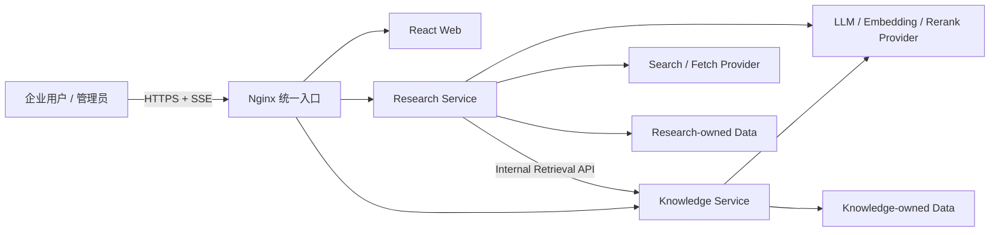
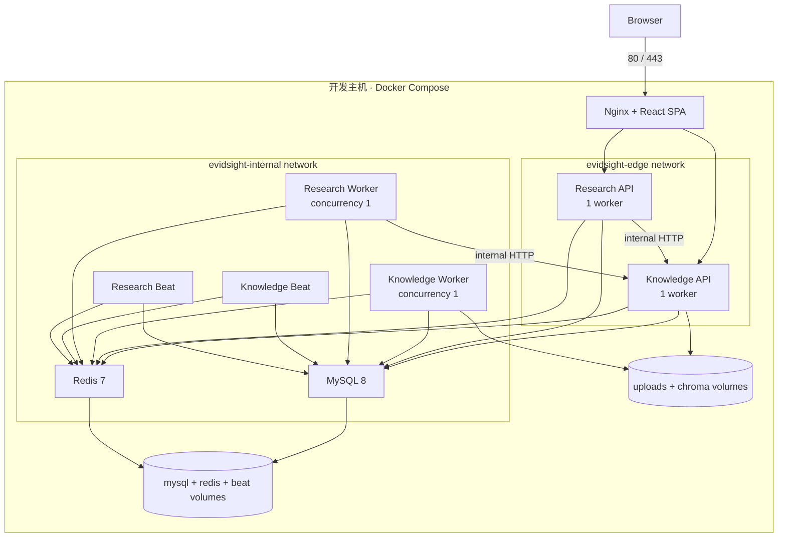
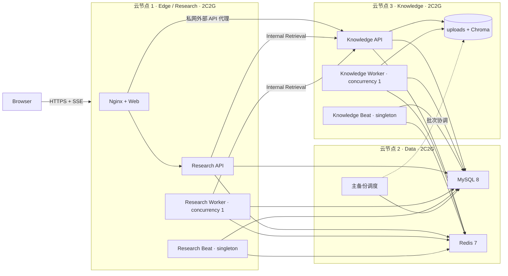

# 据见（EvidSight）总体技术架构与部署拓扑

| 属性 | 值 |
|:---|:---|
| 文档状态 | 已确认 |
| 文档版本 | v1.0 |
| 日期 | 2026-08-08 |
| 部署基线 | 生产三节点 Docker Compose（每节点 2 vCPU / 2 GB RAM）；开发单机全栈 Compose |

> 本文档是据见总体架构、服务边界、部署拓扑和系统级技术要求的权威规范。产品定位、用户、功能范围和验收标准见 [PRD.md](PRD.md)。字段级 API、事件、数据库和 Pipeline 细节由各自专项规范定义，本文不复制其定义。

## 1. 目标与范围

### 1.1 目标

据见第一版在一个 Monorepo 和一套统一部署入口中整合企业知识与深度研究能力，同时保持 Knowledge Service 与 Research Service 的独立业务边界。架构必须支持：

- 统一登录、前端、网关和审计上下文；
- 企业知识问答与 `knowledge`、`web`、`hybrid` 三类研究任务；
- Research Service 通过稳定的 Internal Retrieval Contract 使用企业知识；
- 内部与外部证据进入统一 Evidence Graph 和报告；
- 文档入库与研究长任务异步执行、失败恢复和断点续跑；
- 在三台 2C2G 云节点组成的试点环境中可部署、可诊断、可备份、可恢复和可回滚；
- 在不改变业务契约的前提下保留单机全栈开发入口，并允许后续升级或托管化基础设施。

### 1.2 非目标

第一版不提供：

- 多节点高可用、自动故障转移或跨地域灾备；
- Kubernetes 生产编排；
- 独立 Identity Service；
- 两个后端数据库、Pipeline、Worker 或 Alembic 历史的物理合并；
- Chat SSE 与 Research SSE 的业务事件统一；
- 通用 Agent 平台、插件市场或工作流编辑器；
- 默认常驻的 Prometheus、Grafana、Loki 等完整可观测套件。

## 2. 架构原则

1. **契约优先**：跨服务对象先在 `packages/contracts/` 定义版本化契约，再实现 Provider 和 Consumer。
2. **数据归属明确**：每项业务数据只有一个所有者；服务不得直读另一服务的业务表、向量目录或 ORM Model。
3. **内部知识不外泄**：私有文档内容不得自动进入互联网搜索词；外发模型调用受配置、脱敏和审计约束。
4. **证据优先于报告**：Evidence Graph 是可复用资产，报告是其版本化表达。
5. **异步任务可恢复**：业务状态持久化到 MySQL；Redis、SSE 连接和 Worker 内存都不是唯一事实来源。
6. **试点资源优先**：默认低并发和排队，优先保持核心 API 与数据服务可用，禁止用过量并发换吞吐。
7. **双模式编排**：生产按三节点服务数据岛部署，开发保留单机全栈 Compose；两种模式复用镜像、配置 Schema、契约和健康检查。

## 3. 系统上下文



外部用户只访问云节点 1 的 Nginx。Knowledge Service 和 Research Service 不直接暴露到公网；`/internal/v1/*` 只允许生产私网中的授权服务访问。开发单机模式以 Docker 私有网络提供等价隔离。

## 4. 逻辑架构与职责

### 4.1 Web Application

`apps/web/` 是唯一前端，负责统一登录入口、导航、知识中心、据见问答、研究任务、报告、证据面板和管理中心。

- 所有 HTTP 请求通过模块化 `api/` 客户端发起。
- Chat SSE 与 Research SSE 使用共享的帧级基础能力，但保留独立事件解析器和状态机。
- 研究报告引用与 Evidence 面板双向联动。
- 打开内部证据原文时重新请求 Knowledge Service，不依赖报告中的历史正文授权。

### 4.2 Knowledge Service

`services/knowledge/` 拥有以下能力和数据：

- 统一身份入口：登录、刷新、退出以及用户启用状态；
- 知识库、文档、分块、权限、会话和问答；
- 文档上传、解析、分块、Embedding、向量存储和删除；
- BM25、向量召回、RRF、粗排、Rerank 与内部 Evidence 生成；
- `/internal/v1/retrieval/*` 权限感知检索；
- 内部证据原文和来源位置的实时授权访问。

Knowledge Service 不依赖 Research Service 的任务、Agent Runtime、Research Step 或 Evidence Graph 实现。

### 4.3 Research Service

`services/research/` 拥有以下能力和数据：

- 研究任务、Phase-Locked ReAct Agent Runtime 和三层状态模型；
- Planning、Search、Fetch、Rerank、Synthesis、Evidence Graph Build 和 Report Render；
- `knowledge`、`web`、`hybrid` 来源策略；
- Knowledge Search Tool 与 Internal Retrieval Contract Consumer；
- 研究 Task、Step、Execution Context、租约、恢复扫描和研究 SSE；
- 外部来源、Evidence Item、Evidence Graph、报告章节、成本和审计轨迹。

Research Service 只验证统一 JWT，并在调用内部检索时传递用户身份和请求审计上下文；它不保存或签发 Refresh Token。

### 4.4 Contract Package

`packages/contracts/` 定义跨服务的稳定纯数据契约，包括：

- Internal Retrieval Request/Response；
- Evidence Contract；
- 跨服务错误语义、版本和兼容规则；
- 必需的 Provider/Consumer 测试样例。

契约不得暴露 SQLAlchemy Model、Chroma Collection、磁盘路径、缓存 Key 或服务内部状态对象。

## 5. 运行时组件

| 组件 | 实例数 | 默认并发 | 职责 |
|:---|:---:|:---:|:---|
| Nginx | 1 | 由 Nginx 管理 | TLS 终止、SPA 静态文件、外部 API 路由、SSE 代理 |
| Knowledge API | 1 | Uvicorn worker = 1 | Auth、Knowledge、Chat、Internal Retrieval |
| Research API | 1 | Uvicorn worker = 1 | 研究任务、状态、SSE、报告与证据查询 |
| Knowledge Worker | 1 | Celery concurrency = 1 | 文档入库、重处理和删除 |
| Research Worker | 1 | Celery concurrency = 1 | Agent Runtime、研究执行、重试与恢复任务 |
| Knowledge Beat | 1 | 单调度实例 | Knowledge 周期清理与维护任务 |
| Research Beat | 1 | 单调度实例 | 租约检查、恢复扫描和周期清理 |
| MySQL 8 | 1 | 共享实例 | 三个逻辑数据库的业务事实持久化 |
| Redis 7 | 1 | 共享实例 | 缓存、限流、幂等锁、Broker 和 Result Backend |
| ChromaDB | 嵌入式 | 受 Knowledge 进程约束 | Knowledge 向量索引，经抽象层访问 |

Knowledge Beat 与 Research Beat 必须分别保持单实例，避免重复调度。两个 Celery Worker 不得注册或消费对方任务。

## 6. 部署拓扑

### 6.1 开发单机全栈 Compose

根 `docker-compose.yml` 是 Mac 等开发机的完整本地入口，不是生产落位声明。开发环境可在不连接生产网络的情况下启动全部组件，使用独立数据卷和开发密钥；不得连接生产 MySQL、Redis、Knowledge 持久目录或读取生产 Secret。



### 6.2 生产三节点拓扑

生产环境按 [ADR-011](../decisions/ADR-011-three-node-distributed-deployment.md) 固定为三个服务数据岛；Windows 与 Mac 均不承担生产唯一职责。



节点职责不得交换为让 Mac 或 Windows 承担唯一生产组件。Knowledge API、Knowledge Worker、Knowledge Beat、uploads 与 Chroma 必须位于云节点 3；在迁移到对象存储和网络化向量服务之前不得跨节点拆分。

生产 Compose 入口固定为：

- `deploy/compose/cloud-edge.yml`：云节点 1；
- `deploy/compose/cloud-data.yml`：云节点 2；
- `deploy/compose/cloud-knowledge.yml`：云节点 3。

上述文件是 M5 目标资产；未落地或未通过本规范验收前，不得声称三节点生产部署已实现。

### 6.3 网络暴露

- 生产只有云节点 1 对用户网络开放 Nginx 的 `80/443`；必须启用 TLS。
- MySQL、Redis、Knowledge API、Research API 和 Internal API 不映射公网端口。
- 三台云节点优先通过同一 VPC 私网通信；无法共享 VPC 时使用受控加密覆盖网络，不以公网安全组代替私网。
- 管理或诊断端口如需临时开放，只能绑定环回或受控运维私网地址，并在操作完成后关闭。
- Nginx 禁止将 `/internal/v1/*` 配置为外部路由。
- 云节点 2 只允许云节点 1、云节点 3 的已登记私网身份访问 MySQL/Redis；云节点 3 的 API 只允许云节点 1 私网访问。
- 生产通过稳定私网 DNS 发现服务，不在应用中硬编码容器 IP、公网 IP 或开发 Compose 服务名。
- 开发单机模式继续使用 Docker `edge`/`internal` 网络与 Compose 服务名发现。

### 6.4 持久卷

首版至少包含独立持久卷：

- `evidsight_mysql_data`；
- `evidsight_redis_data`；
- `evidsight_knowledge_uploads`；
- `evidsight_knowledge_chroma`；
- `evidsight_research_beat`。

Knowledge API 与 Knowledge Worker 仅在开发主机或云节点 3 内共享 Knowledge-owned 文件和向量卷。Research Service 禁止挂载这些卷；不得通过 SMB/NFS 等共享目录把嵌入式 Chroma 扩展为跨主机存储。

## 7. 数据所有权与隔离

### 7.1 MySQL

单个 MySQL 实例承载三个逻辑数据库：

| 数据库 | 所有者 | 主要数据 |
|:---|:---|:---|
| `platform_db` | Knowledge Service 的身份模块 | users、refresh_tokens；后续组织与角色 |
| `knowledge_db` | Knowledge Service | knowledge_bases、documents、chunks、conversations、messages、Knowledge traces |
| `research_db` | Research Service | research_tasks、research_steps、sources、evidence、reports、Agent memory |

每个逻辑数据库使用独立业务账号和最小权限。服务不得获得另一服务业务库的读写权限。`platform_db` 的跨服务身份语义通过 JWT 和后续身份接口表达，Research Service 不直读其表。

三个数据库分别维护 Alembic version table 和迁移链。跨数据库 ID 不建立外键；Platform User ID 等引用由契约、应用校验和审计保证。

### 7.2 Redis

共享 Redis 实例时必须同时使用独立 Redis DB、显式队列和 Key 前缀。最低隔离如下：

| 用途 | 约束 |
|:---|:---|
| Knowledge cache/lock | `evidsight:knowledge:*` |
| Research cache/lease | `evidsight:research:*` |
| Knowledge queues | `knowledge.ingest`、`knowledge.delete` |
| Research queues | `research.execute`、`research.periodic` |
| Celery result | 两个服务使用不同 Redis DB 或独立实例 |

禁止使用默认 `celery` 队列，禁止无命名空间全局 Key。Redis 数据可帮助恢复和协调，但任务、证据、权限和报告的唯一事实来源必须是 MySQL 或受管持久卷。

共享实例使用 `maxmemory-policy noeviction`，避免 Broker、租约或幂等锁在内存压力下被静默淘汰。缓存写入必须设置 TTL，并在达到内存上限时允许缓存失败和回源；不得为了缓存命中率切换为可能淘汰队列数据的全局策略。

## 8. 核心数据流

### 8.1 统一认证

1. 浏览器经 Nginx 调用 Knowledge Service 的 Auth API。
2. Knowledge Service 验证用户状态并签发统一 Access/Refresh Token。
3. 浏览器携带 Access Token 调用两个服务。
4. 两个服务使用同一算法和 Claim 规范验证 Access Token。
5. Research Service 执行内部检索时传递 Platform User ID、请求 ID 和服务凭证；Knowledge Service 不信任调用方传入的授权结论，而是实时校验用户与知识库权限。

详细 Claim、刷新、禁用用户与服务凭证规范由“统一身份与权限设计”定义。

### 8.2 文档入库

1. Knowledge API 校验身份、知识库写权限、文件类型与大小。
2. API 将文件写入 Knowledge upload volume，在 `knowledge_db` 创建文档记录并提交事务。
3. API 向 `knowledge.ingest` 分发任务并返回 `202 Accepted`。
4. Knowledge Worker 按解析、分块、Embedding、向量入库阶段执行，并持久化 checkpoint。
5. Worker 更新 MySQL 终态；失败时遵循 Knowledge Pipeline 的清理、重试与部分失败规范。

### 8.3 企业知识问答

1. 浏览器连接 Knowledge Chat SSE。
2. Knowledge API 实时校验用户和知识库 READ 权限。
3. Knowledge Pipeline 执行意图识别、问题重写、混合检索、融合、排序、Evidence 和 Prompt 构建。
4. LLM Token 与来源事件通过 Chat SSE 返回；会话和消息持久化到 `knowledge_db`。

### 8.4 Hybrid 研究

```mermaid
flowchart LR
    Input["问题 + hybrid + KB IDs"] --> Task["Research Task"]
    Task --> Internal["内部知识通道"]
    Task --> Web["互联网通道"]
    Internal -->|"Internal Retrieval"| Authz["实时用户与 KB 权限校验"]
    Authz --> KSearch["Knowledge RAG Retrieval"]
    Web --> PublicQuery["只基于公开问题生成搜索词"]
    PublicQuery --> Providers["Search / Fetch"]
    KSearch --> Rank["Candidate Ranking"]
    Providers --> Rank
    Rank --> Synthesis["Synthesis"]
    Synthesis --> Normalize["Evidence Normalization"]
    Normalize --> Graph["Evidence Graph"]
    Graph --> Evaluate["Completeness Evaluation"]
    Evaluate --> Report["Versioned Report"]
```



内部知识通道与互联网通道在 Evidence Normalization 前保持数据域分离：

- 私有文档内容不得自动拼入互联网查询；
- Knowledge Search Tool 只消费 Internal Retrieval Contract；
- 外部搜索和抓取只接收允许外发的信息；
- 归一化后的 Evidence Item 明确记录来源类型、访问范围和来源时间；
- Evidence Graph 可表达 `supports`、`contradicts` 和 `context` 关系；
- 打开内部原文时再次向 Knowledge Service 鉴权，撤权后不得从 Research 缓存正文降级展示。

### 8.5 SSE 与任务生命周期

Chat SSE 是请求生命周期内的流式问答；Research SSE 是长任务状态订阅。两者必须使用独立业务事件协议。

- Chat SSE 断开可终止当前回答生成，具体持久化语义由 Chat 规范定义。
- Research SSE 断开不得取消研究任务；Worker 独立继续执行。
- Research SSE 重连后从 MySQL 中的 Task、Step 和 Execution Context 恢复快照，再推送后续事件。
- Research Task 的取消、失败、部分完成和恢复由统一状态解析器决定，不由 SSE 连接状态决定。

## 9. 权限与信任边界

### 9.1 外部请求

- Nginx 执行基础请求大小、连接和速率限制；业务权限由对应服务执行。
- 两个服务验证 JWT 签名、算法、过期时间、必需 Claim 和用户禁用语义。
- 管理员、资源所有者和普通访问者使用明确权限矩阵，不能用单一布尔判断替代。

### 9.2 服务间请求

Internal Retrieval API 同时验证：

1. 调用方是允许的内部服务；
2. 请求携带合法 Platform User ID 与审计上下文；
3. 用户当前为 active；
4. 用户当前拥有目标 Knowledge Base 的 READ 权限。

服务凭证用于认证 Research Service，不能替代终端用户授权。Internal API 错误不得返回文档正文、密钥、SQL、内部路径或堆栈。

### 9.3 外部 Provider

- 所有 Provider 凭证通过环境变量或 Secret 文件注入，不写入镜像和仓库。
- 外发调用记录 Provider、模型或接口、Task/Request ID、Token/调用成本和策略结果，不记录密钥。
- 敏感内容外发策略默认拒绝未明确允许的内部内容；完整规则在身份与权限专项设计中定义。

## 10. 失败与降级语义

| 场景 | 系统行为 |
|:---|:---|
| Knowledge Service 不可用 | `knowledge` 研究失败；`hybrid` 仅在剩余证据满足阈值且报告明确标记内部来源缺失时可部分完成 |
| 外部 Search/Fetch 不可用 | `web` 研究失败；`hybrid` 仅在剩余证据满足阈值且报告明确标记外部来源缺失时可部分完成 |
| MySQL 不可用 | API 就绪检查失败并停止接收依赖写入的流量；Worker 不确认未持久化完成的任务 |
| Redis 不可用 | 新异步任务分发失败并返回明确错误；已运行任务不得把 Redis 当作完成事实来源 |
| 用户禁用或 KB 撤权 | 停止新的内部检索；内部原文访问返回统一权限错误；历史报告不授予访问权 |
| Research SSE 断开 | 任务继续执行；客户端重连后从持久状态恢复 |
| Worker 异常退出 | 入库从 checkpoint 幂等恢复；研究任务由租约和恢复扫描接管，并跳过已完成 Step |
| 磁盘达到保护水位 | 拒绝新的文件上传和可能扩大持久化占用的任务，保留读取、删除和运维能力 |

`PARTIALLY_COMPLETED` 只表示任务在明确披露缺失来源或失败步骤后仍满足 Evidence Completeness Threshold。阈值的计算公式与字段由 Research Pipeline 规范定义。

## 11. 资源与容量基线

### 11.1 目标环境

- 三台稳定 Linux 云节点，单节点为 x86_64 或 arm64、2 vCPU、2 GB RAM；
- 云节点 2 的数据库磁盘和云节点 3 的 Knowledge 数据磁盘分别按数据量规划，部署前各至少预留 20 GB 可用空间；
- 三节点具备受控私网、UTC 时间同步、Docker Engine 与 Docker Compose v2；
- Mac 仅作为单机全栈开发机；Windows 仅作为非关键辅助节点，两者在线状态不计入生产容量。

该环境面向 10–30 名试点用户和低并发，不承诺所有用户同时执行重任务，也不承诺任一云节点故障时自动接管。

### 11.2 默认资源策略

| 组件 | 建议内存上限 | 策略 |
|:---|---:|:---|
| MySQL | 768 MiB | 云节点 2 限制 buffer pool 和连接数，给文件缓存、备份与系统保留空间 |
| Redis | 128 MiB | 云节点 2 设置 `maxmemory` 与 `noeviction`；缓存写失败时回源，Broker 数据不可静默淘汰 |
| Knowledge API | 256 MiB | 1 Uvicorn worker |
| Research API | 256 MiB | 1 Uvicorn worker |
| Knowledge Worker | 320 MiB | concurrency 1，限制 Embedding/向量批次 |
| Research Worker | 320 MiB | concurrency 1，限制 Agent 迭代与并行 Tool Call |
| Knowledge Beat | 64 MiB | 云节点 3 单实例 |
| Research Beat | 64 MiB | 单实例 |
| Nginx | 48 MiB | 静态资源与反向代理 |

容器限制是峰值保护，不是内存预留，不能相加作为常驻占用预算。实施阶段必须用真实工作负载验证 RSS 和 OOM 行为。若内存压力超标，按以下顺序降级：

1. 停止非核心监控与调试组件；
2. 降低检索、Embedding、Fetch 和 LLM 上下文批次；
3. 保持每个服务的重任务并发为 1，并限制批次与队列长度；
4. 限制 Research 任务并发和 Agent 迭代；
5. 扩容主机资源。

不得提高 Worker 并发来解决排队问题。

### 11.3 任务背压

- Knowledge 与 Research 使用独立显式队列，各自同时执行一个重任务。
- 生产三节点中 Knowledge 与 Research Worker 位于不同资源节点，可各执行一个重任务；开发单机全栈模式继续启用跨服务重任务准入锁，避免本机 OOM。
- API 创建任务前执行用户级和系统级并发/队列长度限制。
- 超过上限时返回可重试的业务错误，不同步执行重任务，不静默丢弃。
- 队列等待时间、运行时间和失败率必须进入日志与指标。

## 12. 可观察性

### 12.1 日志

所有应用输出结构化 JSON 到 stdout/stderr，由 Docker `json-file` 驱动轮转。日志至少包含：

- UTC timestamp；
- level、service、environment、version；
- request_id；
- user_id（存在时）；
- research_task_id、step_id 或 document_id（存在时）；
- error_code 和可公开错误摘要；
- latency、Provider、Token 或成本字段（适用时）。

禁止记录密码、Token、Cookie、Provider Key、完整私有文档正文和未脱敏 Prompt。

### 12.2 指标

两个 API 暴露仅内部可访问的 `/metrics`。第一版至少提供：

- HTTP 请求量、错误率和延迟；
- SSE 活跃连接和异常断开；
- Celery 队列深度、等待时间、执行时间、成功与失败数；
- 文档入库阶段耗时和失败数；
- 研究 Task/Phase/Step 终态与恢复数；
- Internal Retrieval 延迟、错误率与返回 Evidence 数；
- LLM/Search/Fetch 调用次数、延迟、Token 和成本；
- 数据库连接池使用量与 Redis 错误；
- 磁盘使用量和备份结果。

三节点 2C2G 基线不默认常驻完整 Prometheus/Grafana/Loki。Windows 可保存非权威监控副本或执行诊断，但其离线不得影响生产 readiness、告警事实或核心服务。

### 12.3 Trace

- HTTP 使用 `request_id` 串联 Nginx、Research 和 Knowledge 日志。
- 研究长任务使用 `research_task_id` 和 `step_id` 串联异步执行。
- 文档任务使用 `document_id` 和 Celery task ID 串联。
- 跨服务调用透传 request ID，并生成独立 span/operation 标识；首版不要求部署完整分布式追踪系统。

## 13. 健康检查与启动顺序

### 13.1 探针

每个 API 提供：

- **Liveness**：进程事件循环可响应，不访问外部 Provider；
- **Readiness**：验证服务必需的 MySQL、Redis 和本地持久路径；Knowledge 额外验证向量存储可初始化；
- **Dependency detail**：仅内部或管理员可访问，返回依赖状态，不泄露凭证和连接串。

Celery Worker 使用 `celery inspect ping` 或等价探针。Research Beat 通过调度心跳和最后执行时间检查，不能仅以进程存在判断健康。

### 13.2 启动顺序

```text
MySQL / Redis healthy
  → 执行 platform、knowledge、research 三条迁移链
  → 云节点 3 Knowledge API ready
  → 云节点 3 Knowledge Worker / Knowledge Beat
  → 云节点 1 Research API ready
  → 云节点 1 Research Worker / Research Beat
  → 云节点 1 Nginx 对外就绪
```

外部 Provider 不得成为 API 进程启动的硬依赖，但其不可用必须反映到能力状态、任务失败语义和运维诊断中。

## 14. 备份、恢复、发布与回滚

### 14.1 服务目标

- 恢复点目标：`RPO ≤ 24h`；
- 服务恢复目标：`RTO ≤ 4h`；
- 允许计划内短时维护停机；
- 不承诺任一云节点故障期间持续服务或自动故障转移。

### 14.2 备份

至少每日执行：

1. 云节点 2 上 MySQL 三个逻辑数据库的一致性备份；
2. 云节点 3 上 Knowledge uploads 与 Chroma 卷的同一备份批次快照；
3. Compose、环境变量键名清单、镜像版本和迁移 revision 记录；
4. 备份校验和、完成时间、大小和失败告警。

Redis 不作为唯一业务事实，不以 Redis dump 替代 MySQL 和文件/向量卷备份。发布和数据库迁移前必须额外创建可验证备份。

跨节点备份使用同一批次标识并记录两侧校验和。Windows 可保存加密异地副本，但不得成为唯一备份位置，Windows 离线不得使当日主备份失败。

### 14.3 恢复演练

首次上线前和架构性存储变更后，在空环境完成恢复演练：

1. 在云节点 2 恢复 MySQL，在云节点 3 恢复 Knowledge 持久卷，并核对同一备份批次；
2. 启动数据组件并校验 migration revision；
3. 按三节点启动顺序启动 Knowledge、Research 和 Nginx；
4. 抽样验证用户登录、知识库权限、文档下载/检索、研究任务、报告引用和内部证据二次鉴权；
5. 记录实际 RPO/RTO 和发现的问题。

### 14.4 发布顺序

镜像使用不可变版本标签，禁止生产环境依赖浮动 `latest`。推荐顺序：

1. 配置校验、备份与恢复点确认；
2. 运行向后兼容的数据库迁移；
3. 更新云节点 3 的 Knowledge Worker、Beat 与 API；
4. 更新云节点 1 的 Research Worker、Beat 与 API；
5. 更新云节点 1 的 Web 静态资源与 Nginx；
6. 执行健康检查、契约 smoke test 和旗舰链路 smoke test。

### 14.5 回滚

- 应用回滚使用上一不可变镜像版本。
- 数据库迁移优先使用 expand/contract，使旧应用在发布窗口内仍兼容新 Schema。
- 不可逆数据变换必须提供前滚修复方案和备份恢复步骤，不能声称可直接 downgrade。
- 回滚后重新执行健康检查、登录、问答、任务创建、SSE 和内部检索 smoke test。

## 15. 测试与架构验收

### 15.1 契约与边界

- Internal Retrieval Contract 具有版本、Schema 和 Provider/Consumer 测试。
- Research Service 无法直接连接 `knowledge_db`、Chroma 或 Knowledge 文件卷。
- Knowledge Service 不导入 Research Service 的 `app` 包或 ORM Model。
- Nginx 外部访问 `/internal/v1/*` 必须失败。

### 15.2 权限与安全

- 无权用户不能创建引用目标 KB 的研究任务。
- Research 内部调用不能绕过 Knowledge 的实时用户与 KB 权限校验。
- 研究完成后撤销 KB 权限，报告内部原文立即不可访问。
- 私有文档原文不会出现在外部搜索请求、普通日志和错误响应中。

### 15.3 恢复与一致性

- Knowledge Worker 在解析、Embedding 和向量写入阶段被强制终止后，可幂等恢复或进入明确失败终态。
- Research Worker 被强制终止后，租约扫描恢复任务，且不重复已完成 Step。
- Research SSE 断开与重连不取消任务，重连获得持久化状态快照。
- MySQL、uploads 与 Chroma 从同一备份批次恢复后，抽样文档可检索并可定位原文。

### 15.4 三节点 2C2G 资源与拓扑

- 三份生产 Compose 在对应 2C2G 节点配置内存限制并启动完整组件集合，不默认启动完整 Prometheus/Grafana/Loki。
- 根 Compose 可在 Mac 本地独立启动完整开发栈，不访问生产私网、数据或 Secret。
- 同时提交一个文档入库任务和一个深度研究任务时，生产按节点各自 concurrency 1 执行；开发单机模式通过跨服务准入锁避免 OOM，任务均不丢失。
- 公网只能访问云节点 1 的 `80/443`，云节点 2 数据服务和云节点 3 API/存储公网不可达。
- Mac 或 Windows 离线不影响生产核心能力；任一云节点中断符合 ADR-011 定义的失败语义。
- 达到并发或队列上限时返回明确可重试错误。
- 磁盘达到保护水位后拒绝扩大存储的写操作，同时保留读取、删除和诊断能力。

### 15.5 发布与恢复

- 从空环境按文档顺序完成部署和迁移。
- 使用备份在 `4h` 内完成恢复演练，恢复点不早于 `24h`。
- 使用上一镜像完成一次应用回滚演练，并验证核心 smoke test。

## 16. 演进路径

达到任一条件时，评估从三节点基线继续演进：任一节点持续内存压力、队列等待不可接受、单点故障风险超过业务容忍度、跨节点备份恢复无法满足目标或试点扩大为部门级生产。

推荐演进顺序：

1. 垂直升级出现持续资源压力的云节点，并启用不依赖 Windows/Mac 的生产监控；
2. 将 MySQL 与备份迁至托管高可用数据服务；
3. 将 Redis 按 Knowledge/Research 或 cache/broker 物理拆分并补充高可用语义；
4. 将 uploads 与向量存储迁至支持多实例访问的受管存储；
5. 分别水平扩展无状态 API 和 Worker；
6. 业务需要明确后再迁移到 Kubernetes，并补充高可用与灾备专项设计。

演进不得改变外部 API、Internal Retrieval 或 Evidence Contract 的既有语义；Breaking Change 必须通过新版本和兼容迁移发布。

## 17. 专项文档职责边界

本文确认总体边界，以下细节由对应专项文档持续维护：

1. `docs/plans/MONOREPO_MIGRATION_PLAN.md`：历史导入、目录迁移、构建和第一阶段迁移验收；
2. `docs/specs/IDENTITY_AND_ACCESS.md`：JWT Claims、令牌生命周期、服务凭证、授权上下文和敏感数据外发策略；
3. `docs/specs/API.md` 与 [`packages/contracts/`](../../packages/contracts/README.md)：外部/内部协议表面、错误语义、SSE、跨服务字段、版本和契约测试；
4. [`services/knowledge/docs/DATABASE.md`](../../services/knowledge/docs/DATABASE.md) 与 [`RAG_PIPELINE.md`](../../services/knowledge/docs/RAG_PIPELINE.md)：Knowledge 数据所有权、迁移链和 Internal Retrieval Provider；
5. [`services/research/docs/DATABASE.md`](../../services/research/docs/DATABASE.md) 与 [`RESEARCH_PIPELINE.md`](../../services/research/docs/RESEARCH_PIPELINE.md)：Research 数据、状态解析、Consumer、Evidence Graph 和报告生成；
6. `apps/web/docs/FRONTEND.md` 与 `UIDESIGN.md`：统一路由、模块、状态机、引用交互和 Design Token；
7. [`docs/specs/DATA_MIGRATION_AND_ROLLBACK.md`](DATA_MIGRATION_AND_ROLLBACK.md)：源数据映射、停机窗口、校验、恢复和回滚；
8. [`docs/specs/TESTING.md`](TESTING.md)：环境矩阵、契约与端到端用例、性能基线和发布门禁；
9. [`CONFIGURATION.md`](CONFIGURATION.md)、[`DATA_RETENTION.md`](DATA_RETENTION.md) 与 [`RELIABILITY.md`](RELIABILITY.md)：运行配置、保留清理和可靠性恢复要求；具体操作见 [`guides/OPERATIONS.md`](../guides/OPERATIONS.md)；
10. [`docs/CHANGELOG.md`](../CHANGELOG.md) 与 [`docs/decisions/`](../decisions/README.md)：随规范和实现持续记录变更及重要架构决策。

上述专项文档不得改变本文的服务所有权、网络边界和数据隔离原则；确需改变时先更新本文并新增 ADR。

Monorepo 迁移实施计划完成只代表代码布局与构建基线已就绪，不代表统一身份、Internal Retrieval、统一前端、生产数据迁移或 v1.0 发布验收已完成。上述能力必须分别通过对应专项设计与验收。
