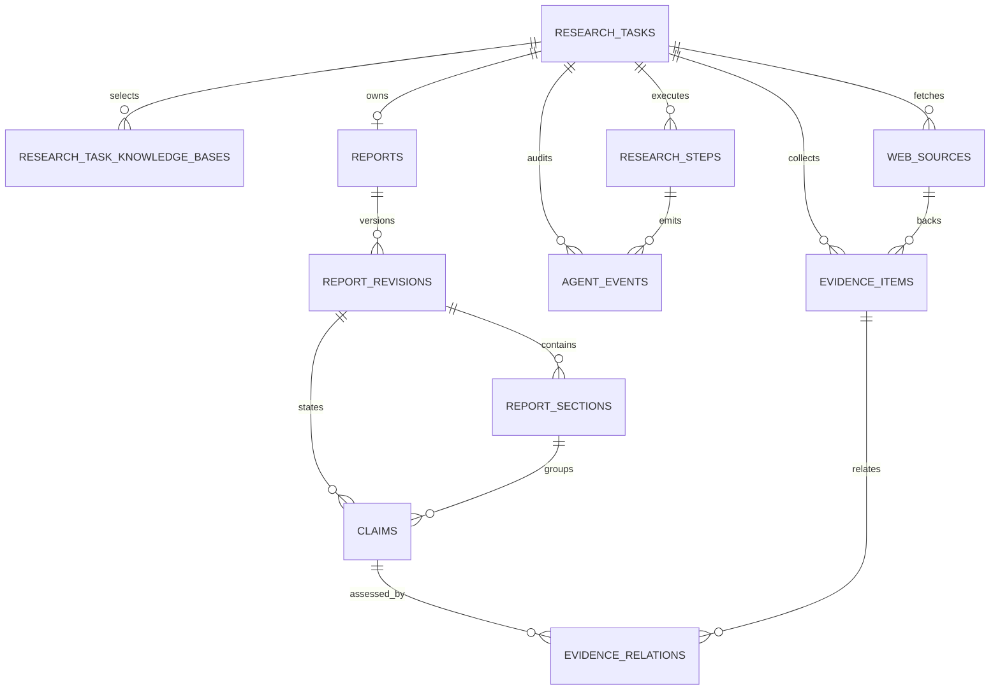

# Research Service 数据库设计

| 属性 | 值 |
|:---|:---|
| 文档版本 | v1.0 |
| 状态 | 已确认设计 |
| 最后更新 | 2026-07-31 |
| 适用范围 | `research_db` |

> 本文是 Research Service 表、约束、索引、生命周期与旧 ResearchMind 数据迁移边界的权威规范。任务状态算法、Evidence Completeness Threshold 和阶段输入输出见 [`RESEARCH_PIPELINE.md`](RESEARCH_PIPELINE.md)；HTTP/SSE 归 [`docs/specs/API.md`](../../../docs/specs/API.md)；跨服务字段归 [`packages/contracts/`](../../../packages/contracts/README.md)。本文不定义 Knowledge 数据表、检索算法或 REST DTO。

## 1. 目标与非目标

本设计支持 `knowledge`、`web`、`hybrid` 三类研究任务，使任务在 Worker 异常、SSE 断开和外部依赖暂时失败后可安全恢复，并形成可审计的 Evidence—Claim—Report 链路。

核心目标：

1. MySQL 是 Task、Step、Evidence 和 Report 的完成事实来源，Redis/Celery 只负责调度与唤醒。
2. Research 只保存 Platform User UUID，不拥有用户、密码或 Refresh Token。
3. 内部知识只持久化 Contract 允许的稳定引用，绝不复制正文、Embedding 或存储路径。
4. 外部网页正文可以受控持久化，以支持恢复和复核，并受过期与级联删除约束。
5. 模型隐藏推理不进入业务表、事件、Trace、报告或错误详情。
6. 报告以不可变 Revision 构建和发布，失败或重试不覆盖已发布版本。

v1.0 明确不做：跨任务来源正文复用、多人协作、局部章节再生成、通用事件溯源平台、跨数据库外键，以及 Research 直读 `platform_db`、`knowledge_db`、Chroma 或上传文件。

## 2. 数据所有权与旧项目关系

### 2.1 三库边界

| 数据域 | 权威所有者 | Research 的使用方式 |
|:---|:---|:---|
| 用户、凭证、启禁用状态 | Knowledge Identity / `platform_db` | 验证 JWT；内部检索时传递 Platform User ID，不直读数据库 |
| KB、文档、Segment、权限 | Knowledge / `knowledge_db` 与其索引 | 仅调用 Internal Retrieval 与来源访问 API |
| Task、Step、Web Source、Evidence、Report、Agent Event | Research / `research_db` | Research 独占读写 |

`research_db` 使用独立账号、独立 Alembic version table 和独立迁移链。不得建立跨数据库外键、共享 ORM Model 或由应用执行跨库 Join。

### 2.2 从 ResearchMind 演进

目标 Schema 继承旧 ResearchMind 的研究任务、步骤、Web 来源、证据、报告章节和执行审计能力，但不是原表的原样复制：

- 删除 Research 自有 `users`、`refresh_tokens`；旧项目没有生产用户，无需用户合并或映射流程。
- `research_tasks.user_id` 从旧 BIGINT 外键改为 Platform User UUID，无跨库外键。
- 将 URL-only `research_sources` 拆为 `web_sources` 与统一无正文 `evidence_items`。
- 将覆盖式 `report_sections` 重构为 `reports`、不可变 `report_revisions`、`report_sections` 与 `claims`。
- 将 `section_evidence` 重构为 Claim—Evidence 关系，显式表达 `supports|contradicts|context`。
- 将可包含 `thought` 的 `agent_memory_entries` 替换为安全的 `agent_events`；不迁移隐藏推理。
- 收紧旧 `execution_context`、Step `input/output` 和 `trace` 的任意 JSON 边界，禁止内部正文和敏感载荷。

## 3. 通用存储约定

### 3.1 标识与时间

- 对外可见的 Task、Step、Source、Evidence、Claim、Report、Revision、Section、Relation 和 Event 均使用应用生成的 UUID。
- Platform User、KB、Document、Document Version 和 Segment 使用其权威服务签发的 UUID；Research 只保存值副本。
- 所有时间列保存 UTC；API 输出带 `Z` 或 `+00:00`。
- `created_at` 不可改写；可变聚合根使用 `updated_at`；不可变发布记录不提供通用更新入口。

### 3.2 JSON 使用限制

JSON 只用于边界稳定但形态有限的配置或安全摘要，必须由版本化 Schema 校验。禁止把 ORM 对象、原始 Provider 响应、完整 Prompt、内部命中对象、内部正文、凭证、隐藏推理、堆栈或文件路径写入 JSON。

Step 输入输出应优先使用独立表和外键。确需 JSON 时，只保存可重放参数、计数、稳定 UUID 和受控枚举，并保存 `schema_version`。

### 3.3 删除与审计

用户删除自己的 Task 或管理员执行治理删除时，以 Task 为根删除全部 Step、Web 正文、Evidence、Claim、Report Revision 和 Agent Event。删除命令自身的治理审计保存在平台审计域，不通过 Task 级联清除。

普通业务删除不得依赖跨数据库级联。用户禁用不会物理删除历史 Task，但停止新执行和恢复；内部来源访问仍需 Knowledge 实时鉴权。

## 4. 领域关系

Task 是删除、授权和执行恢复的聚合根。Evidence 属于 Task，不属于某个 Report Revision；因此重新生成报告可复用同一 Task 已确认的 Evidence，而不复制来源记录。Claim 属于特定 Revision，Relation 将该版本的 Claim 连接到 Task Evidence。

## 5. Task 与执行表

### 5.1 `research_tasks`

| 字段组 | 主要字段 | 约束与语义 |
|:---|:---|:---|
| 身份 | `id`, `user_id` | UUID；`user_id` 无跨库 FK |
| 请求 | `topic`, `task_type`, `source_strategy`, `requirements`, `requirements_schema_version` | `source_strategy=web` 时不得选择 KB；`knowledge|hybrid` 至少一个 KB |
| 幂等 | `idempotency_key`, `request_fingerprint` | `(user_id, idempotency_key)` 唯一；同 Key 不同指纹拒绝 |
| Task 状态 | `status`, `current_phase`, `recoverable` | 枚举与转换由 Research Pipeline 权威定义 |
| 进度 | `total_steps`, `completed_steps`, `total_sources`, `total_evidence` | 派生快照，只由统一状态解析器更新 |
| 控制 | `cancel_requested_at`, `pause_reason` | 取消是请求，不由 API 直接伪造终态 |
| 租约 | `lease_owner`, `lease_expires_at`, `lease_generation` | 领取和续期使用条件更新；generation 单调递增 |
| 恢复 | `recovery_count`, `last_completed_step_id` | 只保存稳定游标，不保存内部摘录 |
| 错误 | `error_code`, `error_summary` | 安全摘要；不得存堆栈、正文或 Provider 原响应 |
| 时间 | `created_at`, `started_at`, `completed_at`, `updated_at` | UTC；终态必须有 `completed_at` |

建议状态集合为 `pending|running|paused|completed|partially_completed|failed|canceled`；Phase 和完整转换规则必须在 Pipeline 规范中冻结。数据库 CHECK 至少保证终态没有有效租约、`completed_steps <= total_steps`、非负计数和来源策略/KB 选择的一致性；涉及关联表的约束由事务服务校验。

终态 Task 不可重新领取。恢复命令只能把 Pipeline 标记为可恢复的 Task 重新投递，不能覆盖历史失败信息；恢复执行会取得新的 `lease_generation`。

### 5.2 `research_task_knowledge_bases`

| 字段 | 语义 |
|:---|:---|
| `task_id` | FK → `research_tasks.id`，级联删除 |
| `knowledge_base_id` | Knowledge 签发的稳定 UUID，无跨库 FK |
| `selection_order` | 用户选择顺序，任务内唯一且非负 |
| `display_name_snapshot` | 创建任务时的名称快照，仅展示和审计使用 |
| `created_at` | UTC |

主键为 `(task_id, knowledge_base_id)`。名称快照不证明 KB 存在或用户有权访问。每次多 KB Internal Retrieval 都由 Knowledge 对全部目标 KB 实时鉴权；任一目标不可访问时，该次请求整体失败。

### 5.3 `research_steps`

| 字段组 | 主要字段 | 约束与语义 |
|:---|:---|:---|
| 身份与顺序 | `id`, `task_id`, `sequence`, `parent_step_id`, `step_type` | `(task_id, sequence)` 唯一；父 Step 必须属于同 Task |
| 状态 | `status`, `attempt_count`, `max_attempts` | `pending|running|completed|failed|skipped|retrying` |
| 结构化上下文 | `input_summary`, `output_summary`, `schema_version` | 只允许白名单字段、稳定 ID、计数和安全摘要 |
| 所有权 | `lease_generation` | 提交结果时必须匹配 Task 当前 generation |
| 成本 | `input_tokens`, `output_tokens`, `estimated_cost_usd`, `model_id`, `duration_ms` | 非负；无调用时为空 |
| 错误与时间 | `error_code`, `error_summary`, `started_at`, `completed_at`, `updated_at` | 错误使用安全摘要 |

Step 完成写入必须是单事务条件更新：Task 的 `lease_owner` 和 `lease_generation` 仍匹配、Task 未终止或取消、Step 仍属于当前 attempt，才可写业务结果并标记 completed。过期 Worker 的迟到提交返回冲突，不得覆盖恢复 Worker 的结果。

旧 Worker 遗留的 running Step 在 Task 租约过期后由 Recovery Scanner 转为 `retrying` 或 `failed`；已 completed 的 Step 不重复执行。非幂等外部操作必须保存 Provider 幂等键或独立操作记录，具体由 Pipeline 定义。

### 5.4 `agent_events`

`agent_events` 是追加式业务执行审计，不是 Chain-of-Thought 或通用事件源。

| 字段 | 语义 |
|:---|:---|
| `id`, `task_id`, `step_id` | UUID；Step 可空，Task 级联删除 |
| `sequence` | Task 内单调序号，`(task_id, sequence)` 唯一 |
| `event_type` | 阶段进入、Tool 请求、Tool 结果、重试、预算停止、恢复等白名单枚举 |
| `tool_name`, `provider_name` | 可空的受控标识 |
| `input_summary`, `result_summary` | Schema 化安全摘要，只含计数、稳定 ID、策略结果和公开错误码 |
| `request_id`, `trace_id` | 调用链关联，不含凭证 |
| `duration_ms`, `cost_summary`, `created_at` | 观测字段 |

事件不得包含 `thought`、`reasoning`、完整 Prompt、内部 `minimal_excerpt`、网页全文、密钥或堆栈。面向用户的“研究过程”由这些业务事件投影，而不是展示模型隐藏推理。

## 6. 来源与 Evidence 表

### 6.1 `web_sources`

| 字段组 | 主要字段 | 约束与语义 |
|:---|:---|:---|
| 身份 | `id`, `task_id` | UUID；Task 级联删除 |
| 定位 | `original_url`, `canonical_url`, `url_hash`, `domain` | `(task_id, url_hash)` 唯一；完整 URL 仍需二次比较防哈希冲突 |
| 获取 | `fetch_status`, `http_status`, `fetched_at`, `provider_name` | 状态与错误分类由 Pipeline 定义 |
| 显示 | `title`, `author`, `published_at` | 来自页面的观察值，不保证真实性 |
| 正文 | `normalized_content`, `content_hash`, `content_format`, `content_expires_at` | 仅成功抓取写入；到期后清空正文 |
| 错误 | `error_code`, `error_summary` | 不存原响应、Cookie 或请求头 |
| 时间 | `created_at`, `updated_at` | UTC |

Web 正文只在同一 Task 内使用，不跨用户或任务共享。默认保留时长由部署数据保留策略配置；清理任务在 `content_expires_at` 到期后将 `normalized_content` 置空，但保留 URL、哈希、时间、状态和 Evidence 引用，以维持报告审计结构。Task 删除时整行级联删除。

### 6.2 `evidence_items`

`evidence_items` 是 Contract `EvidenceReference` 的关系化持久表示。`source_type` 为 `internal|web`，两类字段严格互斥。

共同字段包括：`id`、`task_id`、`source_type`、`display_title`、`location_summary`、`captured_at`、`source_observed_at`、`score_summary`、`validity`、`created_by_step_id` 和 `created_at`。

内部来源字段：

- `knowledge_base_id`
- `document_id`
- `document_version_id`
- `segment_id`
- `document_display_name_snapshot`

Web 来源字段：

- `web_source_id`，FK → `web_sources.id`
- `canonical_url_snapshot`
- `fetched_at_snapshot`

约束：

1. `source_type=internal` 时内部稳定 ID 必填、`web_source_id` 为空。
2. `source_type=web` 时 `web_source_id` 必填、全部内部 ID 为空。
3. 内部 Evidence Schema 不提供任何正文列；禁止 `excerpt`、`content`、`text`、`chunk_text`、Embedding、Prompt、文件路径或缓存键。
4. 内部唯一键为 `(task_id, knowledge_base_id, document_id, document_version_id, segment_id)`；Web 唯一键为 `(task_id, web_source_id)`。如同一来源需要多个定位，Pipeline 必须产生稳定的细粒度来源 ID 或显式位置散列，不得靠复制正文区分。
5. `validity=available|restricted|missing|stale` 是观察状态，不是授权凭证。

Internal Retrieval 的 `minimal_excerpt` 只能在当前 Step 内存中参与判断。转换为 Evidence 前按 Contract Schema 校验并删除摘录；不得进入 Task、Step、Event、Trace、错误、SSE、Report 或任何恢复字段。恢复到内部检索 Step 时，Research 使用保存的查询参数、KB UUID 和稳定引用重新调用 Knowledge，并接受当前权限与当前索引结果。

## 7. Report 与 Evidence Graph 表

### 7.1 `reports`

每个 Task 最多一个报告根：`id`、`task_id`、`current_revision_id`、`created_at`、`updated_at`。`task_id` 唯一并级联删除；`current_revision_id` 可空，且必须指向同一 Report 的 published Revision。

为避免循环外键影响首次插入，先创建 Report，再创建 Revision；发布事务最后设置 `current_revision_id`。数据库使用延后约束能力不足时，由同一事务中的服务校验加集成测试保证同属关系。

### 7.2 `report_revisions`

| 字段组 | 主要字段 | 约束与语义 |
|:---|:---|:---|
| 身份 | `id`, `report_id`, `revision_number` | `(report_id, revision_number)` 唯一且从 1 递增 |
| 构建 | `status`, `build_step_id`, `based_on_revision_id` | `building|published|failed`；v1.0 重生成整份报告 |
| 摘要 | `title`, `executive_summary`, `language`, `content_hash` | published 后不可变；不得含内部摘录 |
| 完整性 | `evidence_completeness`, `limitations_summary` | 支持部分完成与缺失来源披露 |
| 错误与时间 | `error_code`, `error_summary`, `created_at`, `published_at`, `failed_at` | 状态与时间一致 |

Revision 构建失败标记 failed，不成为当前版本。重试创建新 Revision，不覆盖失败或已发布记录。v1.0 不实现局部章节再生成；`based_on_revision_id` 只记录整份重生成的来源版本，为 P1 扩展保留谱系。

### 7.3 `report_sections`

主要字段为 `id`、`revision_id`、`parent_section_id`、`sequence`、`heading`、`body_markdown`、`section_type` 和 `created_at`。

- `(revision_id, parent_section_id, sequence)` 逻辑唯一；根节点使用独立 `root_sequence` 或规范化空父键，避免 MySQL NULL 唯一语义产生重复。
- 父 Section 必须属于同 Revision。
- `body_markdown` 可包含综合结论和引用标记，但不得嵌入内部来源摘录或可绕过权限的历史正文。
- published Revision 下的 Section 不可更新或删除。

### 7.4 `claims`

Claim 是报告中接受 Evidence 评估的最小结论单元，主要字段为 `id`、`revision_id`、`section_id`、`sequence`、`statement`、`certainty`、`qualification` 和 `created_at`。

Claim 必须属于 Section 所在 Revision；`statement` 是综合结论，不得复制内部原文。`certainty` 与 Evidence 完整性算法由 Pipeline 定义，数据库只保存受控枚举或范围值。

### 7.5 `evidence_relations`

| 字段 | 语义 |
|:---|:---|
| `id` | 稳定 UUID |
| `claim_id`, `evidence_id` | FK；Claim 的 Revision 与 Evidence 的 Task 必须同属一个 Task |
| `relation_type` | `supports|contradicts|context` |
| `confidence` | 0—1，表示关系判断置信度，不代表来源绝对真实性 |
| `rationale_summary` | 可选安全摘要，不得复制内部正文 |
| `created_by_step_id`, `created_at` | 生成来源与时间 |

唯一键为 `(claim_id, evidence_id, relation_type)`。跨 Task 关系由事务服务拒绝，并通过集成测试覆盖。一个 Evidence 可关联多个 Claim，一个 Claim 也可同时具有支持与反驳来源。

### 7.6 原子发布

报告发布按以下顺序执行：

1. 创建 `building` Revision。
2. 写入 Section、Claim 和 Evidence Relation。
3. 校验 Section 树、Claim 归属、跨 Task 关系、引用完整性、内部正文禁入和 Evidence Completeness。
4. 单事务将 Revision 设为 published，并切换 `reports.current_revision_id`。
5. 事务提交后发送 `report.updated`；SSE 事件不是发布事实来源。

任一步失败时当前已发布 Revision 保持不变。构建中的数据可保留为 failed 供审计，之后按失败构建保留策略清理。

## 8. 并发、租约与恢复

Worker 领取 Task 使用单条条件更新：Task 非终态、未请求取消、租约为空或已过期。成功后写入新的 `lease_owner`、`lease_expires_at` 并递增 `lease_generation`。续租只能由当前 owner 执行。

Recovery Scanner 按 `(status, lease_expires_at)` 查找过期运行任务：

1. 锁定 Task 并再次确认租约过期。
2. 标记遗留 running Step 为 retrying 或按重试上限 failed。
3. 清除旧 owner，递增恢复计数并重新投递。
4. 新 Worker 从 `last_completed_step_id` 和持久业务结果恢复；不重复 completed Step。
5. 旧 Worker 的提交因 owner/generation 不匹配而失败。

SSE 断开不修改 Task 或租约。取消接口只写 `cancel_requested_at`；Worker 在安全检查点停止后，由统一状态解析器根据已完成 Step、Evidence 完整度和不可恢复错误决定 `canceled`、`partially_completed` 或其他终态。

Redis 丢失不得改变 MySQL 中的任务完成事实。消息重复投递通过 Task 状态、租约 generation、Step 唯一键和条件更新实现幂等。

## 9. 索引策略

必须建立以下查询路径，具体索引名由迁移统一：

| 表 | 索引列 | 用途 |
|:---|:---|:---|
| `research_tasks` | `(user_id, created_at DESC)` | 用户任务列表 |
| `research_tasks` | `(user_id, status, created_at DESC)` | 用户状态筛选 |
| `research_tasks` | `(status, lease_expires_at)` | Worker 领取与恢复扫描 |
| `research_tasks` | unique `(user_id, idempotency_key)` | 创建幂等 |
| `research_task_knowledge_bases` | `(knowledge_base_id, task_id)` | 治理影响分析，不用于授权 |
| `research_steps` | unique `(task_id, sequence)` | 恢复顺序与幂等 |
| `research_steps` | `(task_id, status)` | 状态聚合 |
| `agent_events` | unique `(task_id, sequence)` | SSE/审计游标 |
| `web_sources` | unique `(task_id, url_hash)` | 同任务 URL 去重 |
| `web_sources` | `(content_expires_at)` | 正文过期清理 |
| `evidence_items` | `(task_id, source_type, captured_at)` | Evidence 列表 |
| `report_revisions` | unique `(report_id, revision_number)` | 版本定位 |
| `report_sections` | `(revision_id, parent_section_id, sequence)` | 章节树 |
| `claims` | `(revision_id, section_id, sequence)` | 报告渲染 |
| `evidence_relations` | `(evidence_id, relation_type)` | Evidence 反向查询 |

索引不得包含正文列。高基数 URL 使用固定长度哈希索引；哈希命中后仍比较 canonical URL。上线前用目标 MySQL 版本的 `EXPLAIN` 验证任务列表、恢复扫描、报告加载和 Evidence 反查。

## 10. 外键与不可变规则

- Task 子表默认 `ON DELETE CASCADE`；Step 的 `parent_step_id` 和 Section 的 `parent_section_id` 不允许通过删除父节点制造残缺树。
- `created_by_step_id` 等审计来源在删除单个 Step 的管理操作中使用 `RESTRICT`；正常生命周期只删除整个 Task。
- Web Evidence 到 `web_sources` 使用 `RESTRICT`，防止单独删除来源破坏报告；正文过期通过清空内容而不是删除来源行实现。
- published Revision、其 Section、Claim 和 Relation 在应用层与数据库触发前检查中保持不可变；修订必须新建 Revision。
- 不使用跨数据库 FK；Platform User、KB 和 Knowledge 来源 ID 的存在性及权限在服务调用时验证。

数据库约束无法表达的“同 Task”“同 Revision”和来源分型规则，必须集中在 Domain Service 中，并由迁移后约束测试和集成测试固定；不得散落在 Controller 或 Worker 分支中。

## 11. 隐私、保留与清理

| 数据 | 保留语义 |
|:---|:---|
| 内部 `minimal_excerpt` | 不持久化；只存在于当前 Step 内存 |
| 内部 Evidence Reference | 随 Task 保留；不授予当前原文权限 |
| Web 正文 | 保存至 `content_expires_at`；到期清空正文 |
| Web URL 与抓取元数据 | 随 Task 保留，用于引用与审计 |
| Agent Event | 随 Task 保留；仅安全业务摘要 |
| failed/building Revision | 按部署失败构建保留策略清理；不得成为当前报告 |
| published Revision | 随 Task 保留；Task 删除时级联删除 |
| Trace/成本 | 仅保存计数、耗时、模型/Provider 标识和安全错误 |

任何日志、指标、Trace、SSE 和错误响应都不得成为绕过本表级保留策略的正文副本。用户被禁用后，Research 停止新的 Task、恢复和内部检索；恢复启用不自动恢复旧任务。

## 12. 迁移顺序

1. 在 `research_db` 建立独立 Alembic 基线和 Research 最小权限账号。
2. 创建 Task、KB 选择、Step 与 Agent Event 表，启用 Platform User UUID。
3. 创建 Web Source、Evidence、Report、Revision、Section、Claim 与 Relation 表。
4. 迁移旧 ResearchMind 非用户业务数据时，先转换 Task/Step，再转换 Web Source/Evidence，最后为旧报告生成 revision 1。
5. 丢弃旧 `users`、`refresh_tokens` 与隐藏推理字段；对旧 JSON 只迁移白名单业务字段。
6. 对无法转换成严格 EvidenceReference 的记录标记迁移失败并隔离，不得把旧正文塞入内部 Evidence。
7. 运行外键、同 Task/Revision、正文禁入、租约竞争、恢复幂等和报告发布验收后再切换流量。

由于两个旧项目没有生产用户，不设计用户名合并、用户映射表或双写身份过渡。迁移环境中的 Task 如需保留，必须由受控脚本显式赋予合法 Platform User UUID；否则只作为离线测试 Fixture，不进入目标业务库。

## 13. 验收场景

1. `knowledge|hybrid` Task 未选择 KB 时创建失败；`web` Task 携带 KB 时创建失败。
2. 相同用户和 Idempotency-Key 的相同请求只创建一个 Task；不同指纹返回冲突。
3. 两个 Worker 竞争同一 Task 时只有一个取得租约；旧 generation 无法提交结果。
4. Worker 在完成若干 Step 后退出，恢复扫描跳过 completed Step 并从安全检查点继续。
5. 内部检索命中转换后，Research 全库、日志、Trace、Event 和 Report 均找不到 `minimal_excerpt` 或等价正文。
6. 任务恢复时重新调用 Knowledge；用户禁用或 KB 撤权后不得从 Research 历史数据恢复内部正文。
7. 多 KB 检索任一 KB 当前无权访问时整次调用失败，不使用其余 KB 伪造完整结果。
8. Web 正文可支持任务恢复；到期清理后正文为空，但 Evidence URL、抓取时间与报告关系仍完整。
9. Claim 同时关联 supports 与 contradicts Evidence 时，两类关系均可查询且不会被覆盖。
10. Report Revision 构建失败时当前版本不变；成功重试创建更高 revision 并原子切换。
11. published Revision 不能原地修改；重新生成产生新 Revision。
12. SSE 断开不取消 Task；重连可从 Task、Step 和 Agent Event 的持久游标恢复快照。
13. Task 删除后所有 Research 子数据被清除，平台治理审计仍保留删除事实。
14. `agent_events`、Step JSON 和错误摘要拒绝隐藏推理、完整 Prompt、内部正文、凭证与堆栈。

## 14. 相关文档与后续边界

- [`docs/specs/ARCHITECTURE.md`](../../../docs/specs/ARCHITECTURE.md)：服务职责、数据所有权、故障与部署边界。
- [`docs/specs/IDENTITY_AND_ACCESS.md`](../../../docs/specs/IDENTITY_AND_ACCESS.md)：Platform User、禁用语义、内部服务身份和实时授权。
- [`docs/specs/API.md`](../../../docs/specs/API.md)：Research Task、Evidence、Report 与 SSE 接口。
- [`packages/contracts/`](../../../packages/contracts/README.md)：RetrievalHit、EvidenceReference、EvidenceRelation 与错误契约。
- [`services/knowledge/docs/DATABASE.md`](../../knowledge/docs/DATABASE.md)：Knowledge 稳定 ID、数据库隔离和内部正文边界。
- [`services/knowledge/docs/RAG_PIPELINE.md`](../../knowledge/docs/RAG_PIPELINE.md)：Internal Retrieval Provider、per-KB 检索和失败关闭语义。

[`RESEARCH_PIPELINE.md`](RESEARCH_PIPELINE.md) 已据此定义 Task/Phase/Step 状态转换、租约与恢复扫描、三类来源策略、Step 输入输出 Schema、内部检索重放、Evidence Completeness Threshold、Evidence Graph 构建、报告发布和 Research SSE 投影。任何改变内部正文持久化、跨服务所有权、租约一致性或报告不可变性的实现，都必须先修订本文；涉及安全或职责变化时同时新增 ADR。
