# Research Pipeline 设计

| 属性 | 值 |
|:---|:---|
| 文档版本 | v1.0 |
| 状态 | 已确认设计 |
| 最后更新 | 2026-08-07 |
| 适用范围 | Research API、Worker、Recovery Scanner 与 Research SSE 投影 |

> 本文是 Research Task/Phase/Step 状态、`knowledge|web|hybrid` 来源策略、Evidence Graph、完整度判定、失败恢复和报告发布的权威规范。持久化结构见 [`DATABASE.md`](DATABASE.md)，HTTP/SSE 表面见 [`docs/specs/API.md`](../../../docs/specs/API.md)，Internal Retrieval 与 Evidence 字段见 [`packages/contracts/`](../../../packages/contracts/README.md)。本文不定义 Knowledge 检索实现、数据库 DDL 或前端布局。

## 1. 目标、原则与范围

Research Pipeline 将用户主题转换为可恢复、可审计且带稳定证据关系的报告。v1.0 保留旧 ResearchMind 的七阶段主链，同时把内部知识接入实现为受契约约束的来源通道。

设计原则：

1. 只有一套 Task/Phase/Step 状态机；来源策略不复制编排逻辑。
2. MySQL 是执行完成事实，Celery 只负责投递，SSE 只负责展示。
3. Research 不访问 Knowledge 数据库、Chroma、上传文件或 ORM，只消费 Internal Retrieval Contract。
4. 内部命中正文只在当前执行内存中使用；持久化门禁后只留下 EvidenceReference。
5. 私有内部正文不得进入 Web 查询、外部 Provider、日志、Trace、事件或报告。
6. LLM 产生结构化候选，程序化校验器决定 Schema 合法性、完整度和允许终态。
7. 取消、预算、租约和权限失败均采用失败关闭语义，不以“尽量生成”绕过安全边界。

v1.0 不做：真 DAG 并行调度、跨任务 Evidence 复用、局部章节再生成、多人协作、通用 Agent 平台、展示隐藏推理，以及把 Chat SSE 与 Research SSE 合并。

## 2. 总体架构

```mermaid
flowchart LR
    Request["Topic + Requirements + Source Strategy"] --> Orchestrator["Research Orchestrator"]
    Orchestrator --> Plan["Planning"]
    Plan --> Search["Searching"]
    Search --> K["Knowledge Channel Adapter"]
    Search --> W["Web Search Adapter"]
    K --> Candidates["Temporary Candidates"]
    W --> Fetch["Fetching Web Pages"]
    Fetch --> Candidates
    Candidates --> Rerank["Channel Rank + Fair Sampling + Global Rerank"]
    Rerank --> Synthesis["Synthesis"]
    Synthesis --> Normalize["Evidence Normalizer"]
    Normalize --> Graph["Evidence Graph Build"]
    Graph --> Evaluate["Completeness Evaluator"]
    Evaluate --> Render["Report Render"]
    Render --> Publish["Report Publisher"]
```



### 2.1 组件职责

| 组件 | 职责 | 禁止事项 |
|:---|:---|:---|
| Research Orchestrator | 推进 Phase、创建 Step、检查租约/取消/预算、调用组件 | 不实现检索算法，不直接决定 Task 终态 |
| Planner | 生成结构化子问题和各通道查询计划 | 不调用来源，不输出隐藏推理 |
| Knowledge Channel Adapter | 构造 Contract 请求、调用 Internal Retrieval、转换临时候选 | 不访问 Knowledge 存储，不保存 excerpt |
| Web Search Adapter | 生成允许外发的查询、调用搜索 Provider、规范化 URL | 不接收私有内部正文 |
| Web Fetcher | 安全抓取、正文提取、Web Source 持久化 | 不抓内网地址，不执行页面主动内容 |
| Candidate Ranker | 通道内排序、公平抽取、全局重排 | 不直接比较不同通道的原始分数 |
| Evidence Normalizer | 严格来源分型、稳定引用转换、正文删除门禁 | 不允许转换失败时保存原始对象 |
| Synthesizer | 产生 Claim、限定、冲突与局限候选 | 不宣布 Task 完成，不伪造 Evidence ID |
| Graph Builder | 校验并持久化 Claim—Evidence Relation | 不依赖 LLM 自由文本建立引用 |
| Completeness Evaluator | 纯函数计算硬门槛、分数和允许终态 | 不调用外部服务，不修改证据 |
| Report Publisher | 构建、校验并原子发布不可变 Revision | 不覆盖旧 Revision |

组件之间传版本化 DTO，不传 ORM 对象。所有 LLM 输出先经过严格 Schema 校验；未知字段默认拒绝。

## 3. 来源策略与阶段矩阵

稳定 Phase 顺序为：

`planning → searching → fetching → reranking → synthesizing → building_evidence_graph → rendering`

| Phase | `knowledge` | `web` | `hybrid` |
|:---|:---|:---|:---|
| planning | 子问题 + 内部查询计划 | 子问题 + 公开 Web 查询计划 | 共享子问题 + 两套隔离查询计划 |
| searching | Internal Retrieval | Web Search | 依次执行 Internal Retrieval 与 Web Search |
| fetching | `skipped` | 抓取 Web URL | 只抓取 Web URL |
| reranking | 内部候选排序 | Web 候选排序 | 通道内排序、公平抽取、全局重排 |
| synthesizing | 基于临时内部工作集 | 基于受控 Web 正文 | 基于分域工作集综合 |
| building_evidence_graph | 固化无正文内部引用 | 固化 Web 引用 | 统一图中保留来源类型 |
| rendering | 报告与内部引用 | 报告与 Web 引用 | 报告明确区分两类来源 |

`fetching=skipped` 是合法已处理结果，不是假装执行，也不降低 `knowledge` 任务完整度。Phase 必须稳定出现于状态快照，客户端可以据此保持统一展示。

Hybrid v1.0 在单 Worker 内按预算顺序执行通道，不要求并行。通道的执行顺序不得改变公平抽取结果；默认先执行 Knowledge，以尽早发现权限或 Contract 失败，但不得把内部结果拼入随后生成的 Web Query。

Phase/Step 边界不得传递内部正文：Searching 结束前丢弃其 excerpt；Reranking 和 Synthesizing 的每个 attempt 都在自己的 Step 内重新调用 Internal Retrieval，按稳定 ID 收敛所需工作集，并在该 Step 完成前释放正文。跨 Step 只传 Research Plan、查询参数、稳定 Candidate/Evidence ID、分数摘要和变更摘要。

## 4. Task、Phase 与 Step 状态

### 4.1 Task 状态

Task 状态为：

- 非终态：`pending|running|paused`
- 终态：`completed|partially_completed|failed|canceled`

允许的主转换：

| 当前状态 | 事件 | 下一状态 | 条件 |
|:---|:---|:---|:---|
| pending | Worker 成功领取租约 | running | 用户仍 active，任务配置合法 |
| running | 可恢复依赖失败且重试耗尽 | paused | Pipeline 明确标记 recoverable |
| paused | 用户恢复且成功取得新租约 | running | 当前权限、预算与依赖允许 |
| running | 全部发布门禁通过 | completed | 完整度满足完整完成条件 |
| running | 有缺失但部分完成门禁通过 | partially_completed | 硬门槛通过且 score ≥ 0.70 |
| running | 不可恢复错误或完整度不足 | failed | 记录安全错误摘要 |
| pending/running/paused | 取消在安全检查点生效 | canceled | 不再提交后续业务结果 |

终态不可恢复为 running；重新研究必须创建新 Task。TaskStateResolver 是唯一可写终态的组件，根据数据库中 Step、Evidence、发布 Revision、取消请求、完整度和错误事实计算结果。

### 4.2 Phase 状态

Phase 是 Task 的当前阶段投影，不建立独立完成事实表。进入 Phase 前先创建对应 Step；Phase 完成由该阶段必需 Step 的状态聚合得到。Phase 枚举固定为七阶段名称，客户端必须容忍未来新增非终态枚举。

Phase 不允许倒退写入。恢复时可以重新执行依赖内部工作集的阶段，但通过新 Step attempt 表达；Task 的 Phase 仍指向当前重放阶段，并由 Agent Event 记录恢复原因。

### 4.3 Step 状态与 attempt

Step 状态为 `pending|running|completed|failed|skipped|retrying`。Step 的业务结果和 `completed` 状态必须同事务提交；提交时验证 Task lease owner 与 generation。

同一逻辑 Step 的重试递增 `attempt_count`。可复用旧业务结果时跳过已 completed Step；必须重建内部工作集时创建新 attempt，并使依赖该输入的后续 Step 重新执行。过期 Worker 的迟到写入因 generation 不匹配被拒绝。

### 4.4 创建前身份复核

创建长期研究任务（`POST /api/v1/research/tasks`）前，Research 必须通过 `GET /internal/v1/identity/users/{platform_user_id}/status` 实时复核 Platform User 的当前状态。该调用只依赖 Service JWT、Contract 版本、`X-Request-ID` 与 W3C Trace Context，不读取 Knowledge 数据库或本地用户表（见 [`docs/specs/API.md`](../../../docs/specs/API.md) §11.1 与 [`packages/contracts/`](../../../packages/contracts/README.md) §5.1）。

- 成功响应 `status=active` 才允许创建任务；用户不存在或已禁用统一返回 `AUTH_USER_DISABLED`，任务创建被拒绝，不得创建 Task 或投递 Worker。
- 身份事实源暂时不可用返回可重试的 `INTERNAL_IDENTITY_UNAVAILABLE`，任务创建失败关闭；不得用历史 `active` 响应或 Access Token 剩余有效期放行新任务。
- v1.0 不缓存身份状态；创建任务前必须实时调用，不得复用陈旧结果。未来引入状态缓存前，必须先定义短 TTL、`status_version` 比较和禁用事件主动失效机制（对齐 [`docs/specs/IDENTITY_AND_ACCESS.md`](../../../docs/specs/IDENTITY_AND_ACCESS.md) §3.3）。
- 身份复核失败不得分发 Worker，也不得把状态结论写入 Task 业务字段或日志摘要。

## 5. Planning

### 5.1 输入与输出

输入为 Topic、`task_type=comparison|explainer|analysis`、来源策略、语言、深度、来源上限、预算和所选 KB UUID。输出 `ResearchPlan`：

- 3—5 个稳定 `sub_question_id` 与自包含问题；
- 每个子问题的重要级别 `required|optional`；
- 期望覆盖维度；
- Knowledge Query 和/或 Web Query 的生成规则；
- 预算在子问题与通道间的上限分配；
- 版本化 `plan_schema_version`。

Planner 不保存或展示内部思考理由；可以保存面向用户的简短“研究范围摘要”，但它必须是业务说明而非隐藏推理。

### 5.2 任务类型策略

| task_type | 规划约束 |
|:---|:---|
| comparison | 围绕一致的对比维度覆盖所有候选对象，防止只为单方搜集证据 |
| explainer | 覆盖定义、机制、主要观点、争议与适用边界 |
| analysis | 覆盖原因、直接影响、间接影响、风险与应对 |

输出 Schema 不合法时允许有限次数的模型重试；重试仍失败是不可恢复 Planning 错误。空 Topic、非法来源策略或超预算请求在创建 Task 前拒绝。

### 5.3 查询域隔离

Knowledge Query 可保留用户明确提供的内部实体名称，但 Web Query 只能来自原始用户 Topic、公开 Requirements 和 Planner 产生的公开子问题。Internal Retrieval 的 excerpt、内部文档标题、内部命名、检索结果或报告草稿不得自动进入 Web Query。

Hybrid 中两套查询计划在 Planning 输出即显式分离，并由外发策略校验器检查 Web Query；失败关闭，不降级发送原始私有内容。

## 6. Searching 与 Fetching

### 6.1 Knowledge Channel

对每个计划批次，Adapter 使用 Research 服务身份、Platform User ID、全部目标 KB UUID、请求/Trace ID 和精确 Contract 版本调用 Internal Retrieval。

Knowledge 在执行前验证服务身份、Contract、用户 active、全部 KB active 和逐 KB READ。任一 KB 失败时整次多 KB 请求失败。Research 不拆分重试来绕过全量授权。

响应中的 RetrievalHit 转为内存 Candidate：稳定 KB/Document/Document Version/Segment ID、显示信息、位置、评分摘要、时间和 `minimal_excerpt`。Research 严格校验响应 Schema；未知字段、版本不支持、ID 缺失或返回数量不一致均失败关闭。

重试策略：

- 限流、超时和明确 retryable 的 unavailable：有界指数退避并服从 `Retry-After`。
- 用户禁用、KB forbidden、Contract unsupported、Schema invalid：不重试，停止内部通道。
- `knowledge` Task 的内部通道不可用：不能降级为 Web。
- `hybrid` 的内部通道瞬时失败且重试耗尽：可继续 Web，但只能在最终完整度与披露门禁通过时部分完成。

### 6.2 Web Search Channel

Web Search 按子问题串行执行，遵守单机资源和 Provider 速率限制。每个结果只保存标题、URL、Provider 分数安全摘要和子问题归属；按 canonical URL 去重。

单个子问题无结果或瞬时失败可降级；所有必需子问题均无结果时，`web` Task 失败，`hybrid` 可依赖 Knowledge 继续并在末尾判定完整度。Provider 原始响应、凭证和请求头不得持久化。

### 6.3 Web Fetch

Fetch 只接受 Web Search 产生且通过 URL 校验的目标：

1. 仅允许配置的 `http|https`。
2. DNS 解析前后拒绝 loopback、link-local、私网、保留地址和云元数据地址；重定向每跳重新校验。
3. 限制重定向次数、响应体、解压后体积、Content-Type、连接/读取时限和总耗时。
4. 不执行 JavaScript、宏、插件或下载的主动内容。
5. 清洗为规范文本，计算内容哈希并按 `DATABASE.md` 设置过期时间。

单个 URL 的 timeout、blocked、empty、DNS 或解析失败只影响对应 Step。成功页面不足以覆盖必需子问题时由 Completeness Evaluator 决定部分完成或失败。

## 7. Candidate Ranking

不同通道的原始分数不可直接比较。排序分三层：

1. **通道内处理**：按稳定来源 ID/URL 去重，过滤空内容与硬质量失败，计算通道内相关性、时效和来源质量。
2. **公平抽取**：以子问题为首要分组，从每个可用通道按轮次抽取候选；在达到每个 required 子问题最低候选额度前，不允许单个通道消耗全部预算。
3. **全局重排**：对统一 Candidate DTO 评估与子问题相关性、来源质量、时效、观点多样性和重复度，输出最终顺序。

全局 Reranker 可以使用 LLM，但输入必须遵守预算并只包含任务内受允内容。内部候选必须由当前 Rerank Step attempt 通过 Contract `EvidenceResolveRequest` 按 KB/Document/Document Version/Segment 稳定身份精确重取，不能复用 Searching Step 的 excerpt，也不能用文本查询重新搜索后替换候选。输出只接受 Candidate ID 与受控评分维度，不接受模型生成的新来源或引用；Step 结束前释放全部内部正文。

Rerank 失败时允许一次确定性回退：使用通道内标准化排序与公平抽取结果。回退必须记录降级；若仍满足硬门槛，可继续并影响局限披露，不可静默宣称完整重排成功。

## 8. Synthesis 与 Evidence Normalization

### 8.1 Synthesis 输入输出

Synthesizer 接收 Research Plan 和已选 Candidate 身份列表；其 Step attempt 使用 `EvidenceResolveRequest` 根据稳定 KB/Document/Document Version/Segment ID 精确重取，在当前 Step 内构造临时工作集并输出结构化：

- Claim 草案及 `critical` 标记；
- 每个 Claim 的 Candidate ID 列表与拟议关系；
- 限定条件、不确定性、冲突组和时效风险；
- 按 Section 组织的报告提纲；
- 未覆盖的 required/optional 子问题。

模型不得生成不存在的 Candidate ID，不得把评分当作来源真实性，不得隐藏冲突，也不得输出 Task 终态。输出必须通过严格 Schema 和引用闭包校验。

### 8.2 Evidence 持久化门禁

Evidence Normalizer 将 Candidate 转成 Contract `EvidenceReference`：

- Internal：复制稳定 KB、Document、Document Version、Segment ID、显示名、位置、时间和评分摘要；删除 `minimal_excerpt` 及等价正文。
- Web：引用已持久化 `web_sources`，保存 canonical URL 与抓取时间快照。
- 两类字段严格互斥，并在写库前再次通过 Contract Schema 校验。

转换失败时不得保存原始 Candidate 作为降级。Internal excerpt 不得进入 Task、Step JSON、Agent Event、Trace、错误、SSE、Evidence、Claim、Report 或缓存型恢复上下文。

Evidence 完成持久化后，内存中的内部 Candidate 正文引用应立即释放。后续阶段确需内部语义输入时必须在当前有效租约与权限下重新检索，而不是从持久数据恢复正文。

## 9. Evidence Graph Build

Graph Builder 将通过校验的 Claim 与 Evidence 持久化为：

- `supports`：Evidence 对 Claim 提供正向依据；
- `contradicts`：Evidence 与 Claim 或其适用范围冲突；
- `context`：Evidence 提供背景、定义或限定，不单独证明 Claim。

每条 Relation 包含 0—1 confidence 和可选安全 rationale。confidence 只代表关系判断信心，不代表来源绝对真实性。

程序化门禁：

1. Claim、Evidence 和 Step 必须属于同一 Task。
2. Relation 只能引用已持久化 Evidence ID。
3. 每个 critical Claim 至少一个 `supports`。
4. 重复 `(claim, evidence, relation_type)` 合并，不能覆盖其他关系类型。
5. 存在 `contradicts` 时必须生成冲突披露或限定；不能合成为无条件确定结论。
6. rationale 不得复制内部 excerpt。

Graph Build 是安全 Checkpoint。Schema、归属或正文禁入检查失败为不可发布错误；不得跳过 Graph 直接渲染自由文本报告。

## 10. Evidence Completeness Threshold

### 10.1 定义

只统计 Planning 中标为 `required` 的子问题与来源通道。三个比率均限制在 `[0,1]`：

- `question_coverage = 有至少一条 available Evidence 的 required 子问题数 / required 子问题总数`
- `channel_success = 成功产出至少一条有效 Evidence 的计划通道数 / 计划通道总数`
- `claim_coverage = 有至少一条 supports Evidence 的 critical Claim 数 / critical Claim 总数`

完整度：

```text
evidence_completeness =
    0.50 × question_coverage
  + 0.25 × channel_success
  + 0.25 × claim_coverage
```

所有分子、分母、分项分数、最终分数和规则版本必须持久化到 Report Revision 的完整度摘要，便于审计。不得由 LLM直接给出该分数。

**迁移态（2026-08-07）**：目标态三分项分母依赖 Planning 的 `required` 子问题与计划通道口径。当前 `report_publisher.publish_report` 以最小可审计近似落地：`required_questions` 用 `max(1, task.total_steps)` 近似（§5.1 的 `total_steps`），`channel_success` 按来源策略以「有任意 evidence 即计成功」近似，`claim_coverage` 按 critical Claim 的 supports 关系计算；三分项与总分持久化到 Revision 摘要，供 Resolver 预算停止完整度判定（§10.2/§10.3）与审计读取。该近似由完整通道计划（Planning 输出 required 子问题与通道明细）替代前保持有效，属已登记迁移态，不视为 §10.1 的最终口径。

### 10.2 发布硬门槛

部分完成和完整完成都必须满足：

1. 至少一条有效 Evidence。
2. 存在通过结构校验的 Report Revision、Section 和 Claim。
3. 每个 critical Claim 至少一条 `supports` Relation。
4. 所有引用均闭合到当前 Task 的 Evidence。
5. 缺失通道、失败 required 子问题、冲突、证据不足和时效风险已在报告局限中明确披露。
6. 内部 excerpt 已从所有持久对象、事件和报告删除。

若 Planning 异常地产生零个 required 子问题，Schema 校验失败，不使用空集合得分 1。若 Synthesis 产生零个 critical Claim，报告不可发布。

### 10.3 终态规则

| 结果 | 条件 |
|:---|:---|
| `completed` | 硬门槛通过；三个比率均为 1；无必需 Phase/Step 失败或未披露降级 |
| `partially_completed` | 硬门槛通过；`evidence_completeness ≥ 0.70`；至少存在一个已披露缺失或降级 |
| `failed` | 硬门槛失败，或完整度 `< 0.70`，或发生不可发布的安全/结构错误 |

`contradicts` Evidence 本身不机械扣分，因为主动发现冲突属于研究质量；但未披露冲突会使发布硬门槛失败。Optional 子问题不进入分母，但其失败可以写入局限。

## 11. Report Render 与原子发布

Renderer 根据通过校验的 Graph 和报告模板生成 Section、Claim 展示内容、引用锚点、局限与方法摘要。引用锚点只允许指向 Evidence ID；内部引用不得内嵌历史正文，展开原文必须通过 Knowledge 来源访问 API 实时鉴权。

发布流程：

1. 创建状态为 `building` 的新 Revision。
2. 写入 Section、Claim 和 Relation。
3. 重新运行引用闭包、同 Task/Revision、内部正文禁入与完整度门禁。
4. 单事务将 Revision 设为 `published` 并更新 `reports.current_revision_id`。
5. 事务提交后追加 Agent Event 并发出 `report.updated`。
6. TaskStateResolver 基于已发布 Revision 计算最终 Task 状态。

构建失败时 Revision 标记 `failed`，当前报告不变；重试创建更高 revision number。v1.0 只支持整份重生成，不原地修改 published Revision，不实现局部 Section 替换。

## 12. 错误分类与降级

### 12.1 三类处理

| 分类 | 示例 | 行为 |
|:---|:---|:---|
| retryable | 超时、限流、明确可重试 5xx、瞬时 Provider unavailable | 有界指数退避；耗尽后进入暂停、降级或失败判定 |
| degradable | 单 Web URL、单 optional 子问题、Hybrid 单通道瞬时失败 | 继续收集其余证据，最终过完整度门禁 |
| fail-closed | 用户禁用、任一 KB forbidden、Contract/Schema 不兼容、SSRF 风险、内部正文持久化门禁失败 | 立即停止相关执行，不用剩余数据绕过边界 |

错误码与 `retryable` 必须来自受控分类器；不得通过字符串匹配异常消息判断。对外只返回安全摘要，内部日志也不得包含正文、Prompt、凭证或堆栈到用户可见字段。

### 12.2 来源策略失败矩阵

| 场景 | `knowledge` | `web` | `hybrid` |
|:---|:---|:---|:---|
| Knowledge 瞬时不可用且重试耗尽 | paused/failed | 不适用 | 继续 Web，最终最多 partial |
| KB forbidden 或用户 disabled | failed closed | 不适用 | failed closed，不允许 Web 掩盖授权问题 |
| Web Search 全不可用 | 不适用 | paused/failed | 继续 Knowledge，最终最多 partial |
| 部分 Web Fetch 失败 | 不适用 | 继续并评估完整度 | 继续并评估完整度 |
| Global Rerank 模型失败 | 确定性回退 | 确定性回退 | 确定性回退 |
| Synthesis/Graph Schema 持续失败 | failed | failed | failed |

Hybrid 的“单通道可部分完成”只适用于瞬时能力失败，不适用于权限、Contract、安全或数据泄漏门禁失败。

## 13. 租约、取消与恢复

### 13.1 租约协议

Worker 使用 `research_tasks.lease_owner`、`lease_expires_at` 和单调 `lease_generation` 领取与续租。每个 Provider 调用前后、每个 Step 提交前和每个 Phase 边界检查租约。失去租约的 Worker 立即停止，不提交业务结果。

具体租约时长由部署配置设置，但必须满足：续租周期小于租约时长的一半；单次不可中断操作超时短于剩余租约；Recovery Scanner 的扫描间隔不大于租约时长。配置值及边界测试归实现配置规范，不硬编码在业务逻辑。

### 13.2 取消

取消接口只持久化 `cancel_requested_at`。Worker 在以下安全点检查：

- Phase/Step 开始前；
- 每次外部调用前后；
- 每个 Web URL 完成后；
- LLM 调用前后；
- Graph 持久化前；
- Report 发布事务前。

看到取消后不得开始新外部调用或发布新 Revision。已提交的 Step、Web Source 和 Evidence 可保留供审计；TaskStateResolver 在安全停止后标记 canceled。取消与完成竞态以报告发布事务开始前的条件检查为界：取消已提交则发布拒绝；发布先成功则 Task 按完成事实解析，重复取消幂等返回当前终态。

### 13.3 安全 Checkpoint

可复用 Checkpoint：Planning、每个 Web Search Step、每个 Web Fetch Step、Evidence Reference 固化、Graph Build 和 Report Revision 发布。Checkpoint 的业务结果与 Step completed 同事务提交。

Internal Retrieval、Rerank 和 Synthesis 可以记录 Step 完成及结构化摘要，但不保存内部 excerpt。恢复时若当前阶段或其依赖仍需内部语义工作集，必须重新 Internal Retrieval，并创建新 attempt。

### 13.4 工作集重建与依赖失效

恢复时使用保存的 Research Plan、查询参数和稳定 KB/Document/Document Version/Segment ID，通过 `EvidenceResolveRequest` 重新请求 Knowledge：

1. 重新执行当前用户与全部 KB 权限校验。
2. 校验新 EvidenceResolveResponse Contract。
3. 精确 Version/Segment 不可用时不替换为新 Active Version；当前 attempt 按受控来源失效处理，必要时使依赖步骤失效并从 Searching 创建新的候选闭包。
4. 若工作集变化，令依赖它的 Rerank、Synthesis、Graph 和未发布 Revision 失效并重跑。
5. 已完成 Web Fetch 按内容过期策略复用；正文已过期则重新抓取或按失败策略处理。
6. 已发布 Revision 不修改；用户主动重新研究创建新 Task，整份报告重生成才创建新 Revision。

恢复可能得到不同结果，这是实时权限和当前索引语义的必然结果。系统必须记录恢复 attempt 与输入摘要变化，不能声称逐字复现。

### 13.5 Recovery Scanner

Scanner 查找 running 且租约过期的 Task，锁定后再次确认状态和 generation，将遗留 running Step 置为 retrying 或 failed，清除旧 owner，并重新投递到 `research.execute`（与 API 创建任务共用执行队列，不再使用独立 recovery 队列）。新 Worker 跳过可复用 completed Step；旧 Worker 的迟到提交被 generation 条件拒绝。

Redis 消息丢失或重复不改变 MySQL 完成事实。启动扫描、周期扫描和手动恢复必须调用同一恢复服务，避免三套逻辑分叉。

## 14. 预算、背压与资源约束

Task 创建时冻结最大子问题数、搜索结果数、Fetch 数、LLM Token、Provider 调用、估算成本、Agent 迭代和总时限。每次外部调用前预留预算，完成后结算实际用量；无法预留则停止新调用。

预算停止不是自动成功：已有 Evidence 仍需通过完整度硬门槛；达标可 partial，否则 failed。报告必须披露因预算导致的缺失。

v1.0 基线为单 Research Worker、concurrency 1：

- 子问题和 Web Fetch 默认串行；
- Knowledge Internal Retrieval 使用 Provider 已限定的多 KB 并发；Research 不再展开并行；
- LLM 同一 Task 同时最多一个调用；
- 新任务超过 API 并发或队列上限时按 `docs/specs/API.md` 返回可重试 `429`；
- Worker 不在内存中保留超过当前阶段预算的正文集合，候选需分批处理并及时释放。

## 15. Research SSE 投影

Research SSE 是持久任务订阅，断开不取消 Task。事件由数据库事实和追加式 Agent Event 投影：

| API 事件 | 数据来源 | 约束 |
|:---|:---|:---|
| `snapshot` | Task、当前 Step、当前 Report | 重连首先发送 |
| `task.updated` | Task 状态/进度提交 | 终态只来自 Resolver |
| `phase.updated` | 当前 Phase 与聚合 Step | 不包含 Prompt 或正文 |
| `step.updated` | Step 状态、安全摘要 | 可重复，客户端按 ID 幂等 |
| `evidence.added` | 已提交 Evidence | 内部 Evidence 无 excerpt |
| `report.updated` | 已发布 Revision | building/failed 不作为当前报告 |
| `error` | 安全任务或订阅错误 | 不代表必然 Task 终态 |
| `stream.end` | 本次连接结束 | 不等于 Task 成功 |

事件 ID 使用 Task 内单调 Agent Event sequence 或等价持久游标。重连携带 `Last-Event-ID` 时，服务先读取当前快照，再发送游标后的可用事件；事件缺口时以新快照收敛，不依赖 Redis 历史恢复业务事实。

## 16. 观测与审计

每个 Task/Phase/Step 记录：request/trace ID、状态、attempt、持续时间、候选/来源/Evidence 计数、通道降级、重试、Token、Provider/模型标识、估算成本、预算停止和安全错误码。

禁止记录：完整 Prompt、模型隐藏推理、Internal `minimal_excerpt`、未命中正文、Web 全文、凭证、Cookie、Authorization Header、数据库连接串、磁盘路径或堆栈到用户可见字段。

关键指标：队列等待、Task 各终态比例、Phase 延迟、通道成功率、KB forbidden、Web Fetch 分类、恢复次数、租约冲突、完整度分布、部分完成原因、Report 发布失败和成本分布。指标标签不得使用 Topic、URL、User UUID、KB UUID 或 Evidence ID 等高基数/敏感值。

## 17. 验收与测试

### 17.1 状态与来源策略

1. 三类来源策略都产生同一七阶段状态序列；`knowledge` 的 Fetch 明确为 skipped。
2. `web` 从不调用 Knowledge；`knowledge` 从不调用 Web Search/Fetch；Hybrid 保持查询域隔离。
3. Hybrid 内部和 Web 原始分数不直接比较，公平抽取覆盖 required 子问题与可用通道。
4. 任一 KB forbidden 使 Knowledge/Hybrid 失败关闭，不能拆分 KB 重试或用 Web 掩盖。

### 17.2 Evidence 与报告

5. Internal RetrievalHit 转换后，数据库、日志、Trace、Event、SSE 和报告均无 `minimal_excerpt` 或等价正文。
6. LLM 引用未知 Candidate/Evidence ID 时 Graph Build 失败，不生成虚假引用。
7. supports、contradicts、context 可同时表达；冲突未披露时发布失败。
8. 完整度三分项和总分由固定 Fixture 计算，边界 `0.699...` 失败、`0.70` 可部分完成。
9. 零 required 子问题、零 critical Claim 或零 Evidence 不得利用空集合通过。
10. failed Revision 不切换当前报告；成功 Revision 原子发布且旧版不可变。

### 17.3 失败、取消与恢复

11. SSE 断开后 Worker 继续，重连从持久快照和游标恢复。
12. 两个 Worker 竞争时只有当前 lease generation 可提交 Step。
13. Worker 终止后 Scanner 跳过安全 completed Step，并重新执行需要内部工作集的依赖链。
14. 恢复时用户禁用、KB 撤权或 Segment 集变化按当前事实处理，不使用历史内部正文。
15. 取消在外部调用和发布前生效；取消后不开始新调用或发布新 Revision。
16. Redis 丢失、重复投递和 Recovery Scanner 重复运行不产生重复完成结果。
17. Web URL 的私网、重定向绕过、DNS rebinding、超大响应和危险 Content-Type 均被拒绝。
18. Provider 限流遵守 Retry-After 和预算；重试耗尽后按策略进入 paused、partial 或 failed。

### 17.4 契约与边界

19. Research Consumer 使用 `packages/contracts/` 的全部有效 Fixture，并拒绝无效/未知版本 Fixture。
20. 架构测试证明 Research 无法导入 Knowledge ORM，也无法连接 Knowledge DB、Chroma 或上传卷。
21. Web Query 外发测试证明内部 excerpt、内部文档标题和私有实体不会自动进入搜索请求。
22. Agent Event 和用户可见研究过程不包含隐藏推理或完整 Prompt。

## 18. 相关文档与变更门禁

- [`DATABASE.md`](DATABASE.md)：Task、Step、来源、Evidence、Claim、Report、租约和保留结构。
- [`docs/specs/ARCHITECTURE.md`](../../../docs/specs/ARCHITECTURE.md)：服务边界、故障语义、队列与部署资源。
- [`docs/specs/IDENTITY_AND_ACCESS.md`](../../../docs/specs/IDENTITY_AND_ACCESS.md)：Platform User、内部服务身份、禁用和 KB 实时授权。
- [`docs/specs/API.md`](../../../docs/specs/API.md)：Task 命令、Evidence/Report 查询与 Research SSE。
- [`packages/contracts/`](../../../packages/contracts/README.md)：Internal Retrieval、EvidenceReference、Relation 和错误契约。
- [`services/knowledge/docs/RAG_PIPELINE.md`](../../knowledge/docs/RAG_PIPELINE.md)：Provider 的多 KB 检索、授权顺序和失败关闭语义。

任何改变七阶段顺序、来源隔离、内部正文生命周期、完整度公式、部分完成门槛、租约一致性、取消竞态或 Report Revision 不可变性的实现，都必须先修订本文。跨服务字段变化先修订 Contract；安全、数据生命周期或服务职责变化同时新增 ADR。
